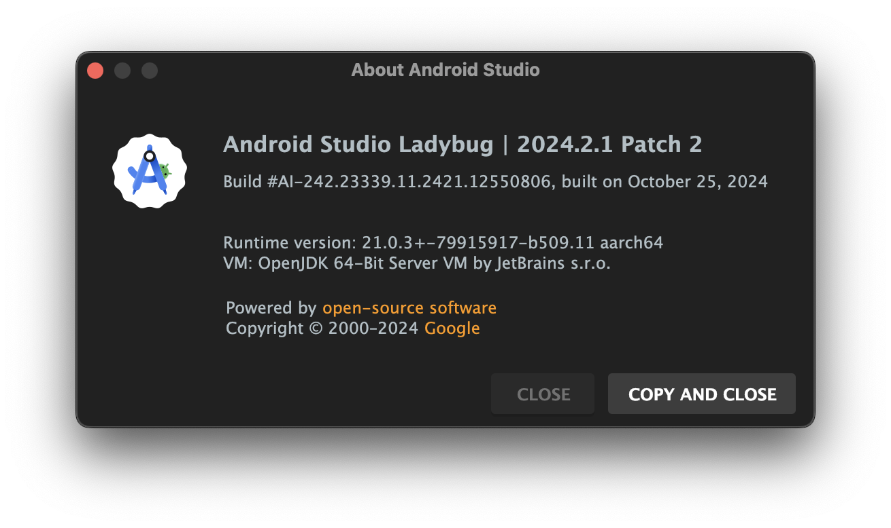
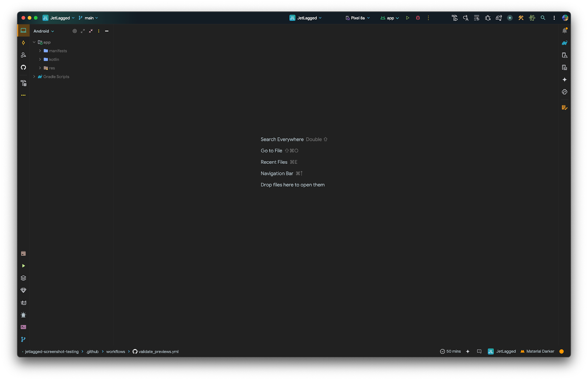

# Compose Preview Screenshot Testing

## Welcome to the world of Screenshot Testing
Duration: 5


**Last Updated:** Mar 24, 2025

### How can you ensure visual consistency in your Jetpack Compose app without manual testing?

In modern Android development, ensuring the visual correctness of user interfaces is critical. Screenshot testing allows developers to automatically capture, compare, and verify the appearance of their app's UI. With the introduction of **Compose Preview Screenshot Testing** in Jetpack Compose, testing UI elements has become even more efficient and accessible. This tool allows you to take advantage of Compose's preview functionality to create pixel-perfect screenshots directly in your development environment.

In this codelab, you'll learn how to set up Compose Preview Screenshot Testing, create and capture screenshots of composables, and incorporate screenshot tests into your development workflow. By the end of this guide, you'll be equipped with the skills to ensure your app's UI remains visually consistent, reducing regressions and enhancing user experience without relying solely on manual testing.

### What you'll build

In this codelab, you will:

1. **Set Up the Environment**:
   - Install the required tools for screenshot testing in Android Studio.
   - Clone the [JetLagged sample project](https://github.com/kartikarora/codelab-compose-preview-screenshot-testing) from GitHub into your local environment as the starting point.

2. **Explore the JetLagged Project**:
   - Understand the key composable UIs within the JetLagged app that will be targeted for screenshot testing.

3. **Setup Jetpack Compose Screenshot Testing library**:
   - Setup the required dependencies and plugins to enable screenshot testing.

4. **Write Screenshot Tests**:
   - Implement screenshot tests for specific UI elements in the JetLagged project.

5. **Generate reference images**:
   - Understand the Gradle command to generate reference images when UI changes and references need updating.

6. **Run and Analyze Tests**:
   - Execute the screenshot tests and review the generated reports to detect any visual regressions or changes in the UI.

> **Experimental:** Compose Preview Screenshot Testing is still in development. Its features and APIs are subject to change substantially during the alpha phase. Report any feedback and issues through the [issue tracker](https://issuetracker.google.com/issues/new?component=192708&template=840533). {.warning}

### What you'll learn
- How to set up Compose Preview Screenshot Testing library
- How to write screenshot tests for Compose Preview Screenshot Testing
- How to set up reference images and run validations
- How to run validation with your CI workflows

### What you'll need
- Android Studio Ladybug | 2024.2.1 Patch 2 or newer



- Knowledge of Kotlin, Android SDK, and Jetpack Compose

### Helpful Readings
Before starting this Codelab, here are some articles to get you up to speed with Jetpack Compose Previews:
- [Designing Effective Compose UIs For Enhancing Previews - Jaewoong Eum](https://proandroiddev.com/designing-effective-uis-for-enhancing-compose-previews-daa8565e109f)
- [Using PreviewParameters and providing Composables to Jetpack Compose Previews - Katie Barnett](https://proandroiddev.com/using-previewparameters-and-providing-composables-to-jetpack-compose-previews-5b1f5a8fe192)
- [5 Tips for Better Compose Previews - Domen Lanišnik](https://medium.com/@domen.lanisnik/5-tips-for-better-compose-previews-0fd51c9aa048)

## Getting set up
Duration: 5

### Setup Android Studio
You will be using Android Studio for this CodeLab. Download the latest stable version for your computer and go through the setup wizard to ensure Java, SDK, and Tools are correctly configured.

[Download Android Studio](https://developer.android.com/studio){.buttonPrimary icon=download}

### Get the code
Everything you need for this project is hosted on GitHub. To get started, grab the code and open it in Android Studio.

**Clone the repository:**
```bash
git clone https://github.com/kartikarora/codelab-compose-preview-screenshot-testing.git
```

[Open Repository](https://github.com/kartikarora/codelab-compose-preview-screenshot-testing){.buttonSecondary icon=code}

[Download Starter Code (ZIP)](https://github.com/kartikarora/codelab-compose-preview-screenshot-testing/archive/refs/heads/main.zip){.buttonPrimary icon=download}

Open the project in Android Studio and let it sync. Once synced, your window should look like this:



## Explore the Project
Duration: 5

Take some time to explore the project. In particular, have a look at various composables and previews.

Run the app on an emulator or a physical device and understand the various UI elements. Feel free to create new previews or set up data for any screenshot tests you might want to create later.

The app contains 7 days worth of sleep data at `app/src/main/kotlin/me/kartikarora/jetlagged/data/FakeSleepData.kt`.

If you run into issues with Previews not rendering in Android Studio (in particular with a `NoSuchElementException`), there's an issue with Compose Preview tooling. This can be fixed by generating 90 days worth of fake data.

In the terminal, run:
```bash
kotlinc -script scripts/generateRandomSleepData.main.kts
```

This script updates `FakeSleepData.kt` with randomly generated 90 days worth of data.

## Setup dependencies
Duration: 10

### Update version catalog
In this project, we are using a Version Catalog to manage dependencies. In the project, you will find the catalog defined in `libs.versions.toml` inside the `gradle` directory:

**gradle/libs.versions.toml**
```toml
[versions]
...
screenshot = "0.0.1-alpha07"

[plugins]
...
screenshot = { id = "com.android.compose.screenshot", version.ref = "screenshot" }
```

Now hit the sync button for Android Studio to fetch the new dependency.

### Apply the plugin
Next, tell the `app` module about this new plugin. Open `app/build.gradle.kts` and add the following:

**app/build.gradle.kts**
```kotlin
plugins {
    ...
    alias(libs.plugins.screenshot)
}

android {
    ...
    experimentalProperties["android.experimental.enableScreenshotTest"] = true
}

dependencies {
    ...
    screenshotTestImplementation(libs.androidx.compose.ui.tooling)
}
```

### Enable the experimental flag
As a final step, tell Gradle that you are explicitly enabling this experimental feature in `gradle.properties`:

**gradle.properties**
```properties
# Enable screenshot tests
android.experimental.enableScreenshotTest=true
```

Sync the project one more time. Once Android Studio finishes syncing, you're ready for the next step!

## Setup previews for testing
Duration: 10

We will be setting up our previews for screenshot testing, and then create some reference images. These reference images will be the "ground truth"—every validation of UI will use these reference images as a baseline.

To designate the composable previews you want to use for screenshot tests, place the previews in a test class located in the `screenshotTest` source set (`app/src/screenshotTest/kotlin/me/kartikarora/jetlagged/PreviewsForTest.kt`):

**app/src/screenshotTest/kotlin/me/kartikarora/jetlagged/PreviewsForTest.kt**
```kotlin
class PreviewsForTest {
    @Composable
    @CombinedPreview
    fun JetLaggedHomeScreenPreview(@PreviewParameter(JetLaggedHomeScreenPreviewProvider::class) uiState: JetLaggedScreenState) {
        JetLaggedHomeScreen(
            sleepGraphData = uiState.sleepGraphData,
            wellnessData = uiState.wellnessData,
            heartRateData = uiState.heartRateData
        )
    }

    @Composable
    @CombinedPreview
    fun JetLaggedHSleepScreenPreview(@PreviewParameter(JetLaggedHomeScreenPreviewProvider::class) uiState: JetLaggedScreenState) {
        JetLaggedSleepScreen(sleepGraphData = uiState.sleepGraphData)
    }

    @Composable
    @CombinedPreview
    fun JetLaggedHeaderPreview(@PreviewParameter(HeaderPreviewDataProvider::class) header: String) {
        JetLaggedHeader(headerText = header)
    }

    @Composable
    @CombinedPreview
    fun JetLaggedHeaderTabsPreview() {
        JetLaggedHeaderTabs(onTabSelected = {}, selectedTab = SleepTab.Month)
    }

    // Heart Rate
    @Composable
    @CombinedPreview
    fun HeartRateCardPreview() {
        HeartRateCard()
    }

    @Composable
    @CombinedPreview
    fun HeartRateGraphPreview() {
        HeartRateGraph(heartRateGraphData)
    }

    // Sleep
    @CombinedPreview
    @Composable
    fun SleepBarPreview() {
        SleepBar(sleepData = sleepData.sleepDayData.first())
    }

    @CombinedPreview
    @Composable
    fun SleepGraphCardPreview(
    ) {
        SleepGraphCard(sleepState = sleepData)
    }

    @CombinedPreview
    @Composable
    fun SleepGraphCardWithHeaderPreview(
    ) {
        SleepGraphCard(sleepState = sleepData, cardHeading = "JetLagged")
    }

    // UI
    @CombinedPreview
    @Composable
    fun FadingCirclePreview() {
        FadingCircleBackground(bubbleSize = 48.dp, color = Color.Magenta)
    }
}

class HeaderPreviewDataProvider : PreviewParameterProvider<String> {
    override val values: Sequence<String> = sequenceOf("JetLagged", "Sleep", "Home")
}
```

Feel free to add more previews and adjust settings until you are happy with the coverage.

## Generate reference images
Duration: 5

Now that the previews are ready, let's generate our reference images. Open the terminal in Android Studio and run the following Gradle task:

**macOS / Linux:**
```bash
./gradlew :app:updateDebugScreenshotTest
```

**Windows:**
```cmd
gradlew :app:updateDebugScreenshotTest
```

Once the task completes, you can find the reference images in `app/src/debug/screenshotTest/reference/`.

## Validate and generate test reports
Duration: 5

With reference images in place, run the tests using the validation Gradle task:

**macOS / Linux:**
```bash
./gradlew :app:validateDebugScreenshotTest
```

**Windows:**
```cmd
gradlew :app:validateDebugScreenshotTest
```

The validation task creates an HTML report at `app/build/reports/screenshotTest/preview/debug/index.html`.

Try modifying the composable UI and running the validation task again—the test will fail and the test report will display an image diff highlighting the exact visual differences!

## Update reference images
Duration: 3

When your UI legitimately evolves, you will need to update the baseline reference images so subsequent test runs pass against the new design.

To update your references, simply re-run the update task:

**macOS / Linux:**
```bash
./gradlew :app:updateDebugScreenshotTest
```

**Windows:**
```cmd
gradlew :app:updateDebugScreenshotTest
```

This will write updated reference images to `app/src/debug/screenshotTest/reference/`.

## Setup with CI
Duration: 10

To automatically validate UI on every push, configure a GitHub Actions workflow.

Create `.github/workflows/validate_previews.yml` in your repository:

**.github/workflows/validate_previews.yml**
```yaml
name: Validate Previews

on:
  push:

jobs:
  validate:
    runs-on: ubuntu-latest
    permissions:
      checks: write
      pull-requests: write

    steps:
      - name: Checkout
        uses: actions/checkout@v4

      - uses: gradle/actions/wrapper-validation@v4

      - name: Setup JDK
        uses: actions/setup-java@v4
        with:
          distribution: 'zulu'
          java-version: 21.0.4

      - name: Make Gradle executable
        run: chmod +x ./gradlew

      - name: Validate UI using screenshot tests
        run: ./gradlew app:validateScreenshotTest

      - name: Upload test result
        uses: actions/upload-artifact@v4
        if: always()
        with:
          name: 'screenshot-test-result'
          path: 'app/build/reports/screenshotTest/preview/debug'

      - name: Publish Test Results
        uses: EnricoMi/publish-unit-test-result-action@v2
        if: always()
        with:
          files: |
            app/build/test-results/**/*.xml
```

What this workflow does:
1. Checks out the repository
2. Validates the Gradle wrapper checksum
3. Sets up JDK 21
4. Makes the Gradle wrapper executable
5. Runs the screenshot validation task
6. Uploads reports to GitHub Artifacts
7. Publishes test result summaries

> **Known Issue:** Because of differences in OS anti-aliasing rendering engines, slight pixel-level variations can occur between reference images generated on macOS/Windows vs Linux CI runners. For more details, see [Issue Tracker #348590914](https://issuetracker.google.com/issues/348590914). {.warning}
