# Hands-On Android App Building with Gemini in Android Studio

## Welcome & starter setup
Duration: 7

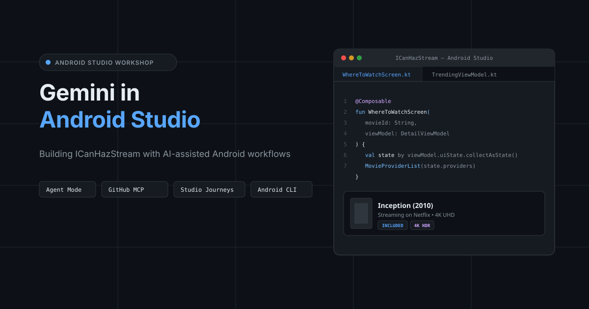

**ICanHazStream** (`me.kartikarora.icanhazstream`) is a multi-module Android app that tracks movie and TV streaming availability across platforms like Netflix, Disney+, Prime Video, Apple TV, Stan, and Binge.

In this workshop, you will use **Gemini in Android Studio** to modernise legacy code, generate Compose UI from wireframes, scaffold multi-module features with **Agent Mode**, connect external context via **GitHub MCP**, and automate tests with **Studio Journeys** and the **Android CLI**.

### Prerequisites
* **Android Studio:** Minimum **Android Studio Quail 4 (2026.1.4+)**.
* **Google Account:** Signed in to Android Studio for Gemini access.
* **JDK:** JDK 21+.

[Download Android Studio (Quail 4)](https://developer.android.com/studio){.buttonPrimary icon=download}

### 1. Install the Android CLI
The `android` CLI allows terminal scripts and AI agents to interact directly with Android Studio tools and daemons.

[Android CLI Documentation & Guide](https://developer.android.com/tools/android-cli){.buttonPrimary icon=terminal}

Install via terminal:

**macOS (Apple Silicon):**
```bash
curl -fsSL https://dl.google.com/android/cli/latest/darwin_arm64/install.sh | bash
```

**macOS (Intel):**
```bash
curl -fsSL https://dl.google.com/android/cli/latest/darwin_x86_64/install.sh | bash
```

**Linux (x86_64):**
```bash
curl -fsSL https://dl.google.com/android/cli/latest/linux_x86_64/install.sh | bash
```

**Windows (cmd):**
```cmd
curl -fsSL https://dl.google.com/android/cli/latest/windows_x86_64/install.cmd -o "%TEMP%\install-android.cmd" && "%TEMP%\install-android.cmd"
```

Verify installation:
```bash
android --version
```

### 2. Install the @kartikarora Compose theme skill
Install the brand skill so Gemini reuses existing `:core:ui` components (`MovieCard`, `ProviderBadge`) instead of generating generic composables:

```bash
npx skills install https://distribute.kartikarora.me/ai/kartikarora-compose-theme.skill
```

### 3. Configure Agent Permissions
Grant appropriate file permissions for Gemini and Agent Mode to read and scaffold files in the multi-module project:

1. Open **Settings** (`Cmd+,` on macOS / `Ctrl+Alt+S` on Windows & Linux).
2. Navigate to **Tools > AI > Agent permissions**.
3. Under **File Permissions**, configure the following options:
   * **Read files in the project:** Set to **Always allow**.
   * **Write source files in the project:** Set to **Always allow** (allows Agent Mode to scaffold composables, ViewModels, and test classes).
   * **Delete or rename files in the project:** Set to **Always allow** (for seamless code refactoring).
   * **Access gitignored files:** Keep at **Ask every time** (sensitive credentials and keys remain protected).

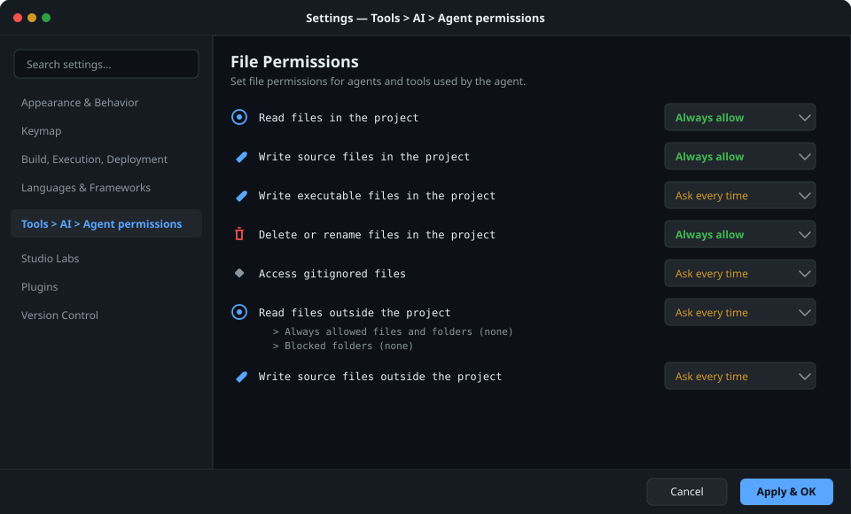

> Files matching patterns in `.aiexclude` (such as keystores and API tokens) are strictly blocked from AI indexing and cloud transmission regardless of agent permissions. {.special}

### 4. Enable Journeys in Studio Labs
Enable natural language user journey testing with automated multimodal vision assertions:

1. In **Settings**, navigate to **Studio Labs** in the sidebar.
2. Check **Journeys** to activate the Studio Journeys testing engine.
3. Click **Apply & OK**.

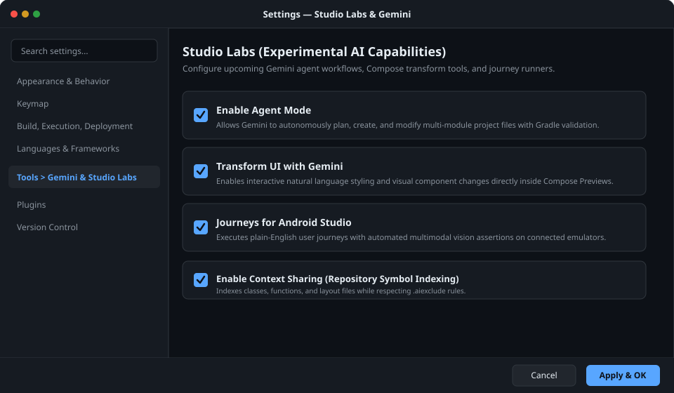

### 5. Open the Agent tool window
Open the dedicated **Agent tool window** via **View > Tool Windows > Agent** (or click the **Agent** icon in the right sidebar). This window is your primary assistant interface for conversational coding, multi-module feature scaffolding, and MCP tool execution.

## Clone starter & project guardrails
Duration: 8

Clone the starter repository, establish engineering conventions in `AGENTS.md`, and block sensitive files with `.aiexclude`.

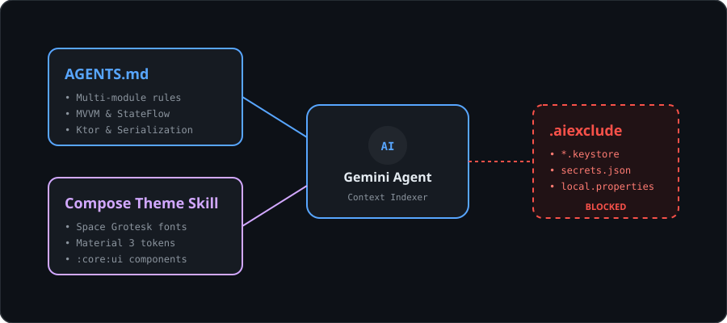

### 1. Clone and open the starter project
Clone the workshop repository from GitHub:

**macOS / Linux:**
```bash
git clone https://github.com/kartikarora/ICanHazStream.git
cd ICanHazStream
```

**Windows (cmd / PowerShell):**
```cmd
git clone https://github.com/kartikarora/ICanHazStream.git
cd ICanHazStream
```

Open **`ICanHazStream`** in Android Studio Quail 4 (2026.1.4+) using **File > Open** and let the Gradle sync complete. Key modules include:
* `:app`: Navigation graph (`StreamNavGraph.kt`).
* `:feature:explore`: Trending movies and provider discovery.
* `:feature:detail`: Movie details and "Where to Watch" availability.
* `:feature:watchlist`: Saved watchlist and price drop alerts.
* `:core:ui`: Ready-made design tokens and components (`MovieCard`, `ProviderBadge`).
* `:core:data`: Repositories and Ktor Client 3.5.2 networking.
* `:core:model`: `@Serializable` domain models (`Movie`, `StreamingProvider`).
* `:core:testing`: In-memory test fakes (`FakeMovieRepository`).

### 2. Define project engineering standards
Create **`AGENTS.md`** in the project root by running this terminal command:

```bash
cat << 'EOF' > AGENTS.md
# ICanHazStream — AI Agent Rules

This document defines the rules and conventions for AI coding assistants working in this project.

## Architecture

- **Multi-module project** using convention plugins from `build-logic/`.
- **Package namespace:** `me.kartikarora.icanhazstream.*`
- **Source convention:** Kotlin files in `src/main/kotlin/`, Java files in `src/main/java/`.

## Brand Design System

The `:core:ui` module contains the **@kartikarora Compose Design System** with:
- `ICanHazStreamTheme` — Material 3 theme with Space Grotesk typography
- `MovieCard` — Brand-styled movie card component
- `ProviderBadge` — Streaming platform badge (Netflix, Disney+, Prime Video, Stan, Binge)
- `RatingChip` — Movie rating display chip
- `StreamTopBar` — Top app bar with brand typography

**Always use these components instead of creating raw Composables.**

## Installed AI Skill

The `kartikarora-compose-theme` skill (installed in `.agents/skills/`) teaches the AI
about the pre-built `:core:ui` component library. When generating UI code, always import
`me.kartikarora.icanhazstream.ui.components.*` and `me.kartikarora.icanhazstream.ui.theme.*`.

## Testing Philosophy

- **Fakes over Mocks**: Use test fakes from `:core:testing` (e.g., `FakeMovieRepository`).
- **JUnit 5** for unit tests, **Turbine** for `StateFlow` testing.
- **Compose UI Test** for instrumented tests.

## JetBrains Stack

- **Ktor Client 3.5.2** for HTTP networking
- **kotlinx.serialization 1.11.0** for JSON parsing
- **kotlinx.coroutines 1.11.0** for async operations
EOF
```

### 3. Block sensitive files from AI indexing
Create **`.aiexclude`** in the project root to prevent API keys and credentials from being indexed or sent to cloud models:

```bash
cat << 'EOF' > .aiexclude
# Block local keystores, private credentials, and solution code from Gemini indexing
*.jks
*.keystore
local.properties
google-services.json
.solutions/
EOF
```

## In-editor refactoring & live diffs
Duration: 8

Refactor code using specific architecture guidelines and review live diffs in the editor.

### 1. Open the target ViewModel
Open **`TrendingMoviesViewModel.kt`** in the **`:feature:explore`** module:

**TrendingMoviesViewModel.kt**
```kotlin
private val _trendingMovies = MutableLiveData<List<Movie>>()
val trendingMovies: LiveData<List<Movie>> = _trendingMovies
```

### 2. Refactor via the Agent tool window
Open the **Agent tool window** (`View > Tool Windows > Agent` or from the right sidebar) and submit your refactoring prompt:

```text
@TrendingMoviesViewModel.kt Refactor the _trendingMovies LiveData stream to StateFlow with an initial empty list, and expose an immutable asStateFlow().
```

Review the side-by-side diff preview and click **Apply Changes** (`Cmd+Enter` or click Apply).

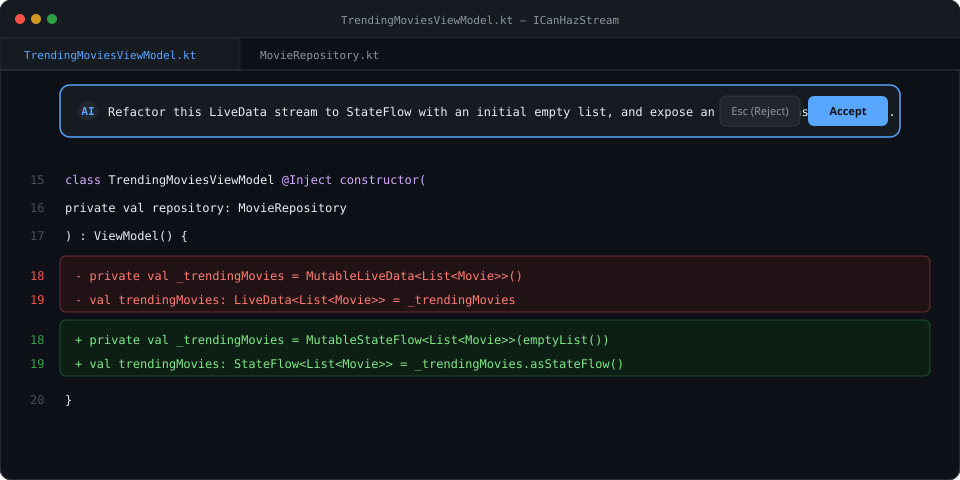

> This is an example of what the generated output might look like. Gemini may generate something different for you. {.warning}

**TrendingMoviesViewModel.kt**
```kotlin
private val _trendingMovies = MutableStateFlow<List<Movie>>(emptyList())
val trendingMovies: StateFlow<List<Movie>> = _trendingMovies.asStateFlow()
```

## Java to Kotlin migration
Duration: 7

Convert legacy Java utilities into idiomatic Kotlin functions.

### 1. Inspect the legacy calculation logic
Open **`WatchCostUtils.java`** in the **`:core:data`** module:

**WatchCostUtils.java**
```java
package me.kartikarora.icanhazstream.data.legacy;

public class WatchCostUtils {
    public static double calculateOptimalWatchCost(double monthlySubscription, double rentPrice, int expectedViews) {
        if (monthlySubscription <= 0.0 || rentPrice <= 0.0 || expectedViews <= 0) {
            return 0.0;
        }
        double totalRentalCost = rentPrice * expectedViews;
        return Math.min(monthlySubscription, totalRentalCost);
    }
}
```

### 2. Run the transform with the Agent tool window
Open the **Agent tool window** (`View > Tool Windows > Agent`) and submit:

```text
@WatchCostUtils.java Convert this Java utility class to an idiomatic Kotlin file with a top-level calculation function in package me.kartikarora.icanhazstream.data.
```

Save the output to **`WatchCostUtils.kt`** in the **`:core:data`** module and delete the old `.java` file.

> This is an example of what the generated output might look like. Gemini may generate something different for you. {.warning}

**WatchCostUtils.kt**
```kotlin
package me.kartikarora.icanhazstream.data

fun calculateOptimalWatchCost(
    monthlySubscription: Double,
    rentPrice: Double,
    expectedViews: Int
): Double {
    if (monthlySubscription <= 0.0 || rentPrice <= 0.0 || expectedViews <= 0) return 0.0
    val totalRentalCost = rentPrice * expectedViews
    return totalRentalCost.coerceAtMost(monthlySubscription)
}
```

## Legacy XML to Compose
Duration: 10

Migrate an XML layout and ViewHolder to a declarative `@Composable` using brand design tokens.

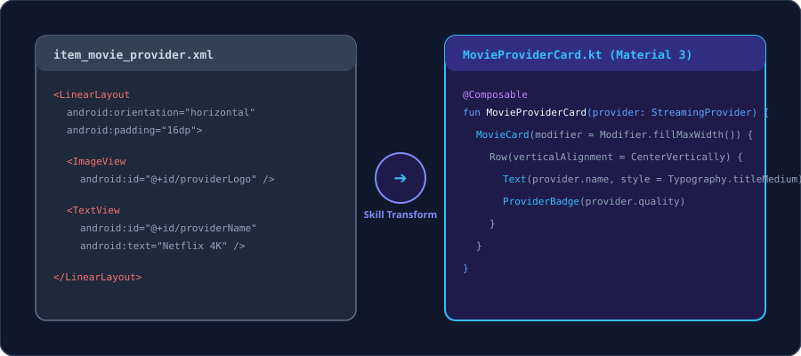

### 1. Inspect the layout and target file
Open **`item_movie_provider.xml`** and **`MovieProviderCard.kt`** in the **`:feature:explore`** module:

**MovieProviderCard.kt**
```kotlin
package me.kartikarora.icanhazstream.explore

import androidx.compose.runtime.Composable
import androidx.compose.ui.Modifier
import me.kartikarora.icanhazstream.model.StreamingProvider

@Composable
fun MovieProviderCard(
    provider: StreamingProvider,
    onClick: () -> Unit,
    modifier: Modifier = Modifier
) {
}
```

### 2. Convert with the Agent tool window
Open the **Agent tool window** (**View > Tool Windows > Agent** or from the right sidebar) and enter:

```text
@item_movie_provider.xml Convert this XML layout and its ViewHolder into a declarative Jetpack Compose composable for MovieProviderCard.kt. Use the @kartikarora design tokens, MovieCard, and ProviderBadge components from :core:ui.
```

> This is an example of what the generated output might look like. Gemini may generate something different for you. {.warning}

**MovieProviderCard.kt**
```kotlin
package me.kartikarora.icanhazstream.explore

import androidx.compose.foundation.layout.*
import androidx.compose.material3.*
import androidx.compose.runtime.Composable
import androidx.compose.ui.Alignment
import androidx.compose.ui.Modifier
import androidx.compose.ui.unit.dp
import me.kartikarora.icanhazstream.model.StreamingProvider
import me.kartikarora.icanhazstream.ui.components.MovieCard
import me.kartikarora.icanhazstream.ui.components.ProviderBadge

@Composable
fun MovieProviderCard(
    provider: StreamingProvider,
    onClick: () -> Unit,
    modifier: Modifier = Modifier
) {
    MovieCard(
        onClick = onClick,
        modifier = modifier
            .fillMaxWidth()
            .padding(horizontal = 16.dp, vertical = 8.dp)
    ) {
        Row(
            modifier = Modifier
                .fillMaxWidth()
                .padding(16.dp),
            verticalAlignment = Alignment.CenterVertically,
            horizontalArrangement = Arrangement.SpaceBetween
        ) {
            Column(modifier = Modifier.weight(1f)) {
                Text(
                    text = provider.name,
                    style = MaterialTheme.typography.titleMedium,
                    color = MaterialTheme.colorScheme.onSurface
                )
                Spacer(modifier = Modifier.height(4.dp))
                Text(
                    text = "Quality: ${provider.quality} • Plan: ${provider.planType}",
                    style = MaterialTheme.typography.bodySmall,
                    color = MaterialTheme.colorScheme.onSurfaceVariant
                )
            }
            ProviderBadge(text = provider.quality)
        }
    }
}
```

## Day-to-day assistant tools
Duration: 5

Speed up daily tasks with built-in documentation, code explanation, and commit helpers.

### 1. Generate KDoc comments
Open **`Movie.kt`** in the **`:core:model`** module. Open the **Agent tool window** (`View > Tool Windows > Agent`) and submit this prompt:

```text
@Movie.kt Generate comprehensive KDoc comments for this data class and all its properties.
```

> This is an example of what the generated output might look like. Gemini may generate something different for you. {.warning}

**Movie.kt**
```kotlin
package me.kartikarora.icanhazstream.model

import kotlinx.serialization.SerialName
import kotlinx.serialization.Serializable

/**
 * Represents a movie or TV title available across streaming services.
 *
 * @property id Unique TMDB identifier.
 * @property title The official release title.
 * @property overview Synopsis and storyline summary.
 * @property posterPath Relative poster image path from TMDB.
 * @property releaseDate The theatrical or digital release date (YYYY-MM-DD format).
 * @property voteAverage Average user rating score out of 10.
 * @property providers List of streaming providers and purchase options for this movie.
 */
@Serializable
data class Movie(
    val id: String,
    val title: String,
    val overview: String,
    @SerialName("poster_path") val posterPath: String? = null,
    @SerialName("release_date") val releaseDate: String? = null,
    @SerialName("vote_average") val voteAverage: Double = 0.0,
    val providers: List<StreamingProvider> = emptyList(),
)
```

### 2. Explain regular expressions
Open **`WatchOption.kt`** in the **`:core:model`** module. Notice the deep-link validation logic:

**WatchOption.kt**
```kotlin
fun isValidDeepLink(): Boolean {
    val urlPattern = Regex("""^https:\/\/(?:www\.)?(?:netflix|disneyplus|primevideo|stan|binge)\.com(?:\/[a-zA-Z0-9_\-\.\/?%&=]*)?$""")
    return deepLinkUrl != null && urlPattern.matches(deepLinkUrl)
}
```

Highlight the regular expression pattern, right-click, and select **AI > Explain Code**. Android Studio automatically sends the selection to the Agent tool window and provides an instant breakdown of capture groups, non-capturing groups, and supported streaming domains.

### 3. Generate commit messages
Stage modified files in the **Commit tool window** (`Cmd+K` / `Ctrl+K`) and click **Suggest Commit Message**:

> This is an example of what the generated output might look like. Gemini may generate something different for you. {.warning}

```text
feat(explore): convert movie provider item layout to Compose and add KDoc
```

## Wireframe to Compose
Duration: 10

Attach UI wireframe sketches directly into the **Agent tool window** to generate Compose layouts.

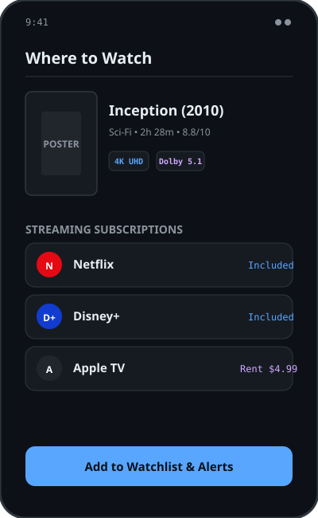

### 1. Locate the wireframe asset
Use **`assets/wireframe-where-to-watch.png`** (or the diagram above) and open **`WhereToWatchScreen.kt`** in the **`:feature:detail`** module.

### 2. Generate screen from mockup
Attach `assets/wireframe-where-to-watch.png` in the **Agent tool window** with this prompt:

```text
Generate the Jetpack Compose screen for WhereToWatchScreen.kt matching this wireframe mockup.
Include:
1. Movie poster header with title, release year, runtime, and 4K UHD badge.
2. Streaming subscription provider cards (Netflix, Disney+).
3. Rent and buy options (Apple TV, Google Play).
4. "Add to Watchlist & Alerts" button at the bottom.
Use Material 3 components and design tokens from :core:ui.
```

Paste the generated composable into `WhereToWatchScreen.kt`.

> This is an example of what the generated output might look like. Gemini may generate something different for you. {.warning}

**WhereToWatchScreen.kt**
```kotlin
package me.kartikarora.icanhazstream.detail

import androidx.compose.foundation.layout.*
import androidx.compose.foundation.lazy.LazyColumn
import androidx.compose.foundation.lazy.items
import androidx.compose.material3.*
import androidx.compose.runtime.*
import androidx.compose.ui.Alignment
import androidx.compose.ui.Modifier
import androidx.compose.ui.unit.dp
import me.kartikarora.icanhazstream.model.Movie
import me.kartikarora.icanhazstream.model.StreamingProvider
import me.kartikarora.icanhazstream.model.WatchOptionType
import me.kartikarora.icanhazstream.ui.components.ProviderBadge
import me.kartikarora.icanhazstream.ui.components.RatingChip

@Composable
fun WhereToWatchScreen(
    movie: Movie?,
    onProviderClick: (StreamingProvider) -> Unit,
    modifier: Modifier = Modifier,
) {
    if (movie == null) return

    var selectedTabIndex by remember { mutableIntStateOf(0) }
    val tabs = listOf("Stream", "Rent", "Buy")
    val currentType = when (selectedTabIndex) {
        0 -> WatchOptionType.STREAM
        1 -> WatchOptionType.RENT
        else -> WatchOptionType.BUY
    }
    val filteredProviders = movie.providers.filter { it.type == currentType }

    LazyColumn(
        modifier = modifier
            .fillMaxSize()
            .padding(16.dp),
        verticalArrangement = Arrangement.spacedBy(16.dp),
    ) {
        item {
            Card(modifier = Modifier.fillMaxWidth()) {
                Column(modifier = Modifier.padding(16.dp)) {
                    Row(
                        modifier = Modifier.fillMaxWidth(),
                        horizontalArrangement = Arrangement.SpaceBetween,
                        verticalAlignment = Alignment.CenterVertically
                    ) {
                        Text(text = movie.title, style = MaterialTheme.typography.headlineMedium)
                        RatingChip(rating = movie.voteAverage)
                    }
                    Spacer(modifier = Modifier.height(8.dp))
                    Text(text = movie.overview, style = MaterialTheme.typography.bodyLarge)
                }
            }
        }

        item {
            TabRow(selectedTabIndex = selectedTabIndex) {
                tabs.forEachIndexed { index, title ->
                    Tab(
                        selected = selectedTabIndex == index,
                        onClick = { selectedTabIndex = index },
                        text = { Text(title) }
                    )
                }
            }
        }

        items(filteredProviders) { provider ->
            Card(modifier = Modifier.fillMaxWidth()) {
                Row(
                    modifier = Modifier
                        .fillMaxWidth()
                        .padding(16.dp),
                    horizontalArrangement = Arrangement.SpaceBetween,
                    verticalAlignment = Alignment.CenterVertically
                ) {
                    ProviderBadge(text = provider.quality ?: "HD")
                    Button(onClick = { onProviderClick(provider) }) {
                        Text("Watch on ${provider.name}")
                    }
                }
            }
        }
    }
}
```

## Interactive Compose Previews
Duration: 8

Iterate on visual styling directly inside the **Compose Preview** panel using natural language.

### 1. Add preview functions
Open the **Agent tool window** (`View > Tool Windows > Agent`) and submit this prompt:

```text
@WhereToWatchScreen.kt Add a @PreviewLightDark Composable preview function WhereToWatchScreenPreview() wrapped in ICanHazStreamTheme.
```

> This is an example of what the generated output might look like. Gemini may generate something different for you. {.warning}

```kotlin
@PreviewLightDark
@Composable
private fun WhereToWatchScreenPreview() {
    ICanHazStreamTheme {
        WhereToWatchScreen(
            movieId = "inception-2010",
            onNavigateBack = {}
        )
    }
}
```

### 2. Style via AI preview tools
1. Build the project (`Cmd+F9` / `Ctrl+F9`) to render the preview.
2. In the Compose Preview toolbar, click the **AI** icon and select **Change UI** (under *For Selected Preview*).
3. Prompt:

```text
Set provider card corner radius to 16dp, add 4K HDR badges next to streaming platforms, and style the 'Add to Watchlist' button with primary container styling.
```

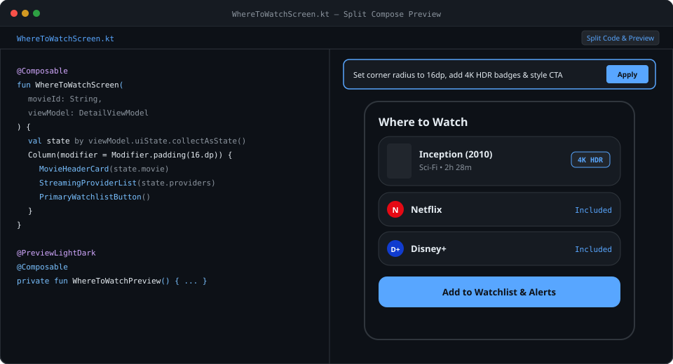

## Connecting GitHub MCP
Duration: 8

Connect Gemini to the **GitHub MCP Server** to ground code generation in repository issues, PRDs, and pull requests.

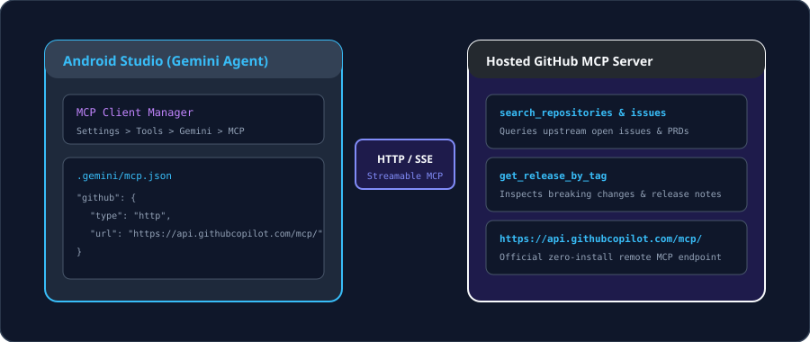

### 1. Configure the MCP server
Add the GitHub MCP server to **`.gemini/mcp.json`** (or via **Settings > Tools > AI > MCP Servers**):

**.gemini/mcp.json**
```json
{
  "mcpServers": {
    "github": {
      "command": "npx",
      "args": ["-y", "@modelcontextprotocol/server-github"],
      "env": {
        "GITHUB_PERSONAL_ACCESS_TOKEN": "${GITHUB_TOKEN}"
      }
    }
  }
}
```

### 2. Query upstream context in the Agent tool window
In the **Agent tool window**, enter:

```text
Using the connected GitHub MCP server, fetch the product requirements and accepted schema from issue #42 ('Watchlist price drop alerts and regional availability notifications'). Ground the implementation in our existing data layer.
```

Gemini queries `get_issue` and `get_file_contents` over MCP to retrieve the exact requirements before scaffolding.

## Multi-module Agent Mode
Duration: 12

Use **Agent Mode** to plan, write, and link features across multiple modules autonomously.

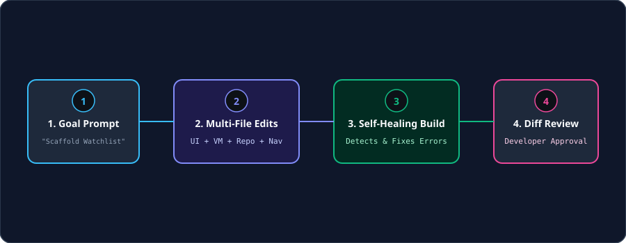

### 1. Launch Agent Mode
In the **Agent tool window** (**View > Tool Windows > Agent**), submit your prompt to build the feature across modules:

```text
Build the "Watchlist & Price Drop Alerts" feature in :feature:watchlist.
1. Create WatchlistViewModel.kt exposing WatchlistUiState (Loading, Empty, Success).
2. Create WatchlistRepository.kt with functions to add movies, track rental price drops, and observe saved titles.
3. Build WatchlistScreen.kt with movie cards, price alert toggles, and swipe-to-delete.
4. Add the watchlist route to the root StreamNavGraph.kt in :app.
Follow the rules in AGENTS.md and use Ktor 3.5.2 and StateFlow.
```

### 2. Review and apply changes
Agent Mode creates `WatchlistViewModel.kt`, `WatchlistRepository.kt`, and `WatchlistScreen.kt` in the **`:feature:watchlist`** module, and registers the route in **`StreamNavGraph.kt`** in the **`:app`** module.

Review the structured multi-file diff and click **Apply All Changes**.

## Automated build repair
Duration: 8

Let Agent Mode run Gradle build tasks and fix missing dependencies automatically.

### 1. Request automated compilation
In the **Agent tool window**, submit:

```text
Check and compile the project by running a Gradle build for :feature:watchlist. If any dependencies or imports are missing in build.gradle.kts or libs.versions.toml, diagnose and fix them.
```

### 2. Self-healing cycle
Agent Mode:
1. Executes `./gradlew :feature:watchlist:assembleDebug`.
2. Spots missing test dependencies (`runTest`, `turbine`).
3. Updates `build.gradle.kts` in the **`:feature:watchlist`** module and syncs Gradle.
4. Re-runs the build until compilation succeeds.

## Unit tests & Turbine
Duration: 8

Generate ViewModel unit tests backed by in-memory fakes and Turbine Flow assertions.

### 1. Open the test skeleton
Open **`WatchlistViewModelTest.kt`** in the **`:feature:watchlist`** module.

### 2. Generate unit tests with the Agent tool window
Open the **Agent tool window** (`View > Tool Windows > Agent`) and submit your test prompt:

```text
@WatchlistViewModel.kt Generate unit tests for WatchlistViewModel inside WatchlistViewModelTest.kt using FakeMovieRepository from :core:testing and app.cash.turbine.test. Include test cases for empty state, adding a movie to watchlist, and price drop notifications.
```

> This is an example of what the generated output might look like. Gemini may generate something different for you. {.warning}

**WatchlistViewModelTest.kt**
```kotlin
package me.kartikarora.icanhazstream.watchlist

import app.cash.turbine.test
import kotlinx.coroutines.test.runTest
import me.kartikarora.icanhazstream.model.Movie
import me.kartikarora.icanhazstream.testing.FakeMovieRepository
import org.junit.jupiter.api.Assertions.assertEquals
import org.junit.jupiter.api.Test

class WatchlistViewModelTest {

    private val fakeRepository = FakeMovieRepository()
    private val viewModel = WatchlistViewModel(repository = fakeRepository)

    @Test
    fun `when movie is added to watchlist, state updates with saved title`() = runTest {
        viewModel.uiState.test {
            assertEquals(WatchlistUiState.Empty, awaitItem())

            val sampleMovie = Movie(
                id = "m1",
                title = "Inception",
                overview = "Dream within a dream",
                releaseYear = 2010,
                rating = 8.8,
                posterUrl = "https://image.tmdb.org/t/p/w500/inception.jpg"
            )

            viewModel.addToWatchlist(sampleMovie)

            val successState = awaitItem() as WatchlistUiState.Success
            assertEquals(1, successState.watchlist.size)
            assertEquals("Inception", successState.watchlist.first().title)
        }
    }
}
```

Run tests (`Ctrl+Shift+R` / `Cmd+Shift+R`) to confirm they pass.

## Crash debugging in Logcat
Duration: 7

Diagnose and patch exceptions directly from Logcat using **Ask Gemini**.

### 1. Trigger the crash
Run the app on the emulator, open Explore, tap **"Untracked Indie Release #9"**, and set region filter to **"Australia (AU)"**.

### 2. Inspect in Logcat
1. Open **Logcat** (`Cmd+6` / `Alt+6`).
2. Find the error:
   ```text
   FATAL EXCEPTION: main
   java.lang.NullPointerException: Missing streaming provider list for region 'AU' in MovieDetailViewModel.kt:42
   ```
3. Click **Ask Gemini** next to the stack trace.

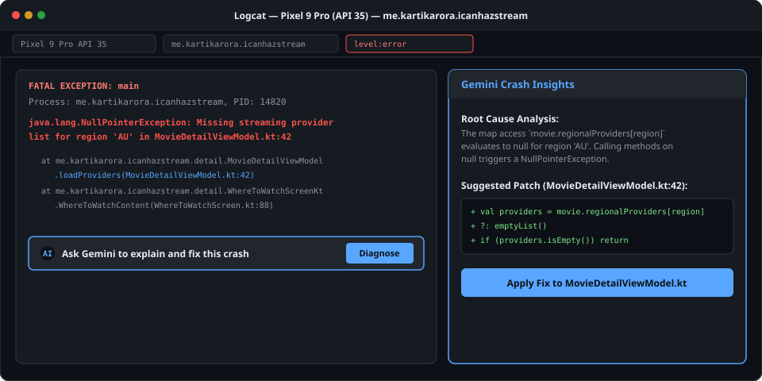

### 3. Apply the patch
Gemini highlights the unhandled null provider list in `MovieDetailViewModel.kt`:

> This is an example of what the generated output might look like. Gemini may generate something different for you. {.warning}

```kotlin
val providers = movie.regionalProviders[selectedRegion] ?: emptyList()
if (providers.isEmpty()) {
    _uiState.value = MovieDetailUiState.NoProvidersAvailable(selectedRegion)
    return
}
```

Apply the change and re-run to verify the fix.

## Studio Journeys E2E tests
Duration: 10

Describe end-to-end user journeys in plain English and execute them on a live emulator using multimodal vision AI.

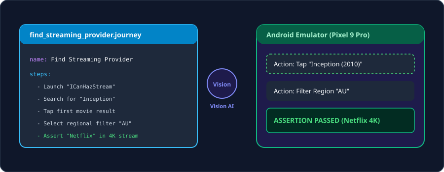

### 1. Inspect the journey definition
Open **`journeys/find_streaming_provider.journey`**:

**find_streaming_provider.journey**
```yaml
name: Find Streaming Provider for Inception
targetApp: me.kartikarora.icanhazstream
steps:
  - Launch the app "ICanHazStream"
  - Tap on the search bar and enter "Inception"
  - Tap on the first movie card in the results
  - Select regional filter "AU"
  - Verify that the screen displays "Netflix" under 4K UHD streaming
```

### 2. Run the journey
1. Start your Android Emulator.
2. Open the **Journeys tool window**.
3. Select `find_streaming_provider.journey` and click **Run Journey**.
4. Watch Gemini interact with the emulator UI and verify assertions automatically.

## Headless Android CLI
Duration: 8

Use the **Android CLI** to inspect symbols, render previews, and run lint checks from scripts and terminal agents.

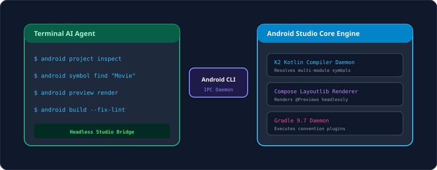

### Useful commands
```bash
# Inspect project modules and configuration
android project inspect

# Search for symbols across all modules
android symbol find "MovieRepository"

# Render Compose previews headlessly
android preview render --module feature:detail

# Run lint checks and apply automatic fixes
android build --fix-lint
```

## App Quality Insights
Duration: 5

Review production telemetry from Firebase Crashlytics and Google Play Vitals inside Android Studio with one-click Gemini diagnostics.

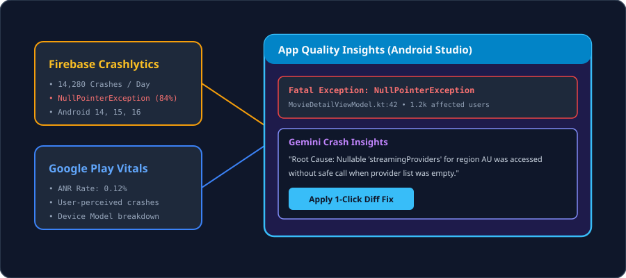

1. **Open AQI:** Navigate to **View > Tool Windows > App Quality Insights**.
2. **Review insights:** Click **Explain Crash with Gemini** on recurring crash clusters.
3. **Apply fix:** Apply the suggested patch directly to your Kotlin source file.

## Summary & next steps
Duration: 2


### Summary of key workflows
* **Guardrails:** Ground code generation with `AGENTS.md`, `.aiexclude`, and design token skills.
* **In-Editor AI:** Refactor `LiveData` to `StateFlow` and explain regex using the **Agent tool window** and **AI > Explain Code**.
* **Modernisation:** Convert legacy Java calculation math and XML layouts to Compose.
* **Design to Code:** Generate UI from wireframes and style interactively in Compose Previews.
* **Context & Tooling:** Connect upstream repository context via **GitHub MCP**.
* **Agent Mode:** Scaffold multi-module features and self-heal Gradle build issues.
* **Verification:** Test `StateFlow` with Turbine fakes, debug crashes in Logcat, and automate E2E testing with **Studio Journeys** and the **Android CLI**.

### Next steps
* **On-device AI:** Experiment with **Gemini Nano via AICore** using the ML Kit GenAI Prompt API.
* **Prompt Library:** Store reusable team prompts in `.idea/project.prompts.xml`.
* **Questions & Feedback:** Reach out at [hello@kartikarora.me](mailto:hello@kartikarora.me).
