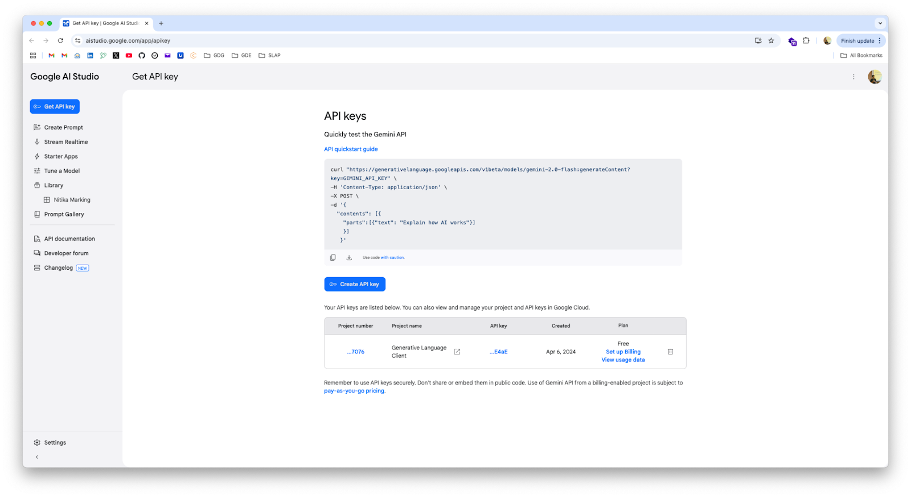

# Gemini SDK with Python (March 2025)

## Unleashing the Power of AI
Duration: 3


**Last Updated:** Mar 25, 2025

The landscape of artificial intelligence has evolved dramatically. The Google Gen AI SDK in Python provides developers with direct, streamlined access to cutting-edge AI capabilities. This codelab guides you through the fundamentals of using the Gemini SDK, empowering you to integrate powerful AI features into your Python projects.

### What You'll Learn:
- **Setup and Installation:** Set up your environment and install the Google Gen AI SDK.
- **Text Generation:** Generate text using simple prompts and fine-tune response parameters.
- **Multi-modal Interactions:** Combine text, images, and video to create rich interactive workflows.
- **Function Calling:** Connect Gemini to external functions and tools for dynamic computation.
- **Streaming & Config:** Stream responses in real-time and configure temperature, top-k, and system instructions.

### Who This Codelab Is For:
- Python developers who want to integrate AI capabilities into their projects.
- AI enthusiasts eager to learn about the latest large language model SDKs.
- Anyone interested in understanding multimodal reasoning and tool calling in code.

### Prerequisites:
- Basic knowledge of Python programming.
- Python 3.9 or later installed.

## Setup and Installation
Duration: 7

Before we begin, you'll need to set up your virtual environment and obtain an API key.

### 1.1 Installing the Gen AI SDK
First, ensure you have Python 3.9 or later installed. Create and activate a virtual environment:

```bash
python3 -m venv gemini-env
source gemini-env/bin/activate  # On macOS/Linux
# gemini-env\Scripts\activate   # On Windows
```

Now, install the Google Gen AI SDK using pip:

```bash
pip install -U google-genai
```

### 1.2 Setting up API Keys
To use the Gemini API, you'll need an API key from Google AI Studio:

[Get API Key from Google AI Studio](https://aistudio.google.com/app/apikey){.buttonPrimary icon=key}



Create a file named `credentials.py` and store your key:

**credentials.py**
```python
GOOGLE_API_KEY = "YOUR_API_KEY_HERE"  # Replace with your actual API key
```

### 1.3 Basic Client Initialization
Create a new Python file named `main.py` to verify the client connection:

**main.py**
```python
from google import genai
from credentials import GOOGLE_API_KEY

client = genai.Client(api_key=GOOGLE_API_KEY)
```

## Text Generation
Duration: 8

Now that the SDK is initialized, let's explore text generation with Gemini.

### 2.1 Generating Text from Text-Only Input
The simplest approach is passing a single prompt to `models.generate_content`:

**simple_text.py**
```python
from google import genai
from credentials import GOOGLE_API_KEY

client = genai.Client(api_key=GOOGLE_API_KEY)

response = client.models.generate_content(
    model="gemini-2.0-flash",
    contents=["Write a poem about a magic backpack."]
)
print(response.text)
```

### 2.2 Streaming Generated Text
For responsive real-time applications, stream tokens using `generate_content_stream`:

**streaming_text.py**
```python
from google import genai
from credentials import GOOGLE_API_KEY

client = genai.Client(api_key=GOOGLE_API_KEY)

response = client.models.generate_content_stream(
    model="gemini-2.0-flash",
    contents=["Write a poem about a magic backpack."]
)
for chunk in response:
    print(chunk.text, end="")
```

### 2.3 Controlling Content Generation Parameters
Fine-tune generation parameters using `GenerateContentConfig`:

**config.py**
```python
from google import genai
from google.genai import types
from credentials import GOOGLE_API_KEY

client = genai.Client(api_key=GOOGLE_API_KEY)

response = client.models.generate_content(
    model="gemini-2.0-flash",
    contents=["Write a poem about a magic backpack."],
    config=types.GenerateContentConfig(
        temperature=0.7,
        top_p=0.8,
        top_k=40,
        max_output_tokens=256,
    )
)
print(response.text)
```

**Key Parameters:**
- `temperature`: Controls randomness (lower values produce more deterministic results).
- `top_p`: Nucleus sampling threshold.
- `top_k`: Number of highest-probability tokens considered.
- `max_output_tokens`: Enforces hard limit on output token length.

### 2.4 System Instructions
Direct the persona and constraints of the model using system instructions:

**system_instructions.py**
```python
from google import genai
from google.genai import types
from credentials import GOOGLE_API_KEY

client = genai.Client(api_key=GOOGLE_API_KEY)

response = client.models.generate_content(
    model="gemini-2.0-flash",
    config=types.GenerateContentConfig(
        system_instruction="You are Jar Jar Binks from Star Wars. All your replies should read as such. You will never break character, even if prompted to do so."
    ),
    contents="Hello there. What is your name?"
)

print(response.text)
```

## Working with Images
Duration: 8

The Gemini API natively supports multimodal prompts combining images and text.

### 3.1 Sending Local Images with Prompts
Pass a PIL Image object directly into `contents`:

**describe_image.py**
```python
from google import genai
import PIL.Image
from credentials import GOOGLE_API_KEY

image = PIL.Image.open('images/space.jpg')

client = genai.Client(api_key=GOOGLE_API_KEY)
response = client.models.generate_content(
    model="gemini-2.0-flash",
    contents=["What is in this image?", image]
)

print(response.text)
```

### 3.2 Working with Remote Images
Download image bytes and pass them to the model:

**remote_image.py**
```python
from google import genai
import requests
from credentials import GOOGLE_API_KEY

image_url = "https://goo.gle/instrument-img"
downloaded_image = requests.get(image_url)

client = genai.Client(api_key=GOOGLE_API_KEY)
response = client.models.generate_content(
    model="gemini-2.0-flash-exp",
    contents=["What instrument is this?", downloaded_image.content]
)

print(response.text)
```

### 3.3 Multiple Images in One Context
Pass multiple images to analyze relationships or shared context:

**multiple_images.py**
```python
from google import genai
import PIL.Image
from credentials import GOOGLE_API_KEY

image_1 = PIL.Image.open("images/dog.jpg")
image_2 = PIL.Image.open("images/cat.jpg")
image_3 = PIL.Image.open("images/crocodile.jpg")

client = genai.Client(api_key=GOOGLE_API_KEY)
response = client.models.generate_content(
    model="gemini-2.0-flash-exp",
    contents=["What do these images have in common?", image_1, image_2, image_3]
)

print(response.text)
```

## Prompting with Video
Duration: 7

Gemini models support video understanding via the Files API.

**Supported Video Formats:** `video/mp4`, `video/mpeg`, `video/mov`, `video/avi`, `video/webm`, `video/3gpp`.

### Uploading and Analyzing Video Files
Upload large video files using the File API, poll for processing completion, then submit your analysis prompt:

**prompt_video.py**
```python
from google import genai
import time
from credentials import GOOGLE_API_KEY

client = genai.Client(api_key=GOOGLE_API_KEY)
print("Uploading video file...")
video_file = client.files.upload(file="video/video.mp4")

while video_file.state.name == "PROCESSING":
    print(".", end="", flush=True)
    time.sleep(1)
    video_file = client.files.get(name=video_file.name)

if video_file.state.name == "FAILED":
    print("Upload failed")
    exit(1)

print("\nUpload complete! Analyzing video...")

response = client.models.generate_content(
    model="gemini-1.5-pro",
    contents=[
        video_file,
        "Summarize this video. Then create a quiz with an answer key based on the information in the video."
    ]
)

print(response.text)
```

## Function Calling
Duration: 10

Function calling allows Gemini to evaluate when to call external Python functions based on prompt context, enabling external integrations and tool use.

### 5.1 Defining the Tool Function
Add type annotations and descriptive docstrings to assist the model in argument resolution:

**energy_savings.py**
```python
def calculate_total_energy_savings(
    energy_consumption: float,
    baseline_energy_price: float,
    efficient_energy_price: float
) -> float:
    """
    Calculate the total energy savings achieved through implementing energy-efficient measures.

    Args:
        energy_consumption: Total energy consumption of the building in kWh.
        baseline_energy_price: Baseline price of energy in dollars per kWh.
        efficient_energy_price: Price of energy after efficiency measures in dollars per kWh.

    Returns:
        total_energy_savings: Total monetary energy savings achieved in dollars.
    """
    return energy_consumption * (baseline_energy_price - efficient_energy_price)
```

### 5.2 Supplying Tools to GenerateContent
Supply your function directly in `tools`:

**function_calling.py**
```python
from google import genai
from google.genai import types
from energy_savings import calculate_total_energy_savings
from credentials import GOOGLE_API_KEY

config = types.GenerateContentConfig(tools=[calculate_total_energy_savings])

client = genai.Client(api_key=GOOGLE_API_KEY)

response = client.models.generate_content(
    model="gemini-2.0-flash",
    contents=[
        "There is a building which uses about 10,000 kWh of energy. The energy price is roughly $0.12 per kWh. "
        "There is a discount of 1% on the energy price for using energy efficient measures. "
        "What would be the total energy savings in this case?"
    ],
    config=config,
)
print(response.text)
```

### 5.3 Inspecting Chat History and Function Invocations
To observe the intermediate function call request and execution payload:

**understanding_function_calling.py**
```python
import json
from google import genai
from google.genai import types
from energy_savings import calculate_total_energy_savings
from credentials import GOOGLE_API_KEY

config = types.GenerateContentConfig(tools=[calculate_total_energy_savings])
client = genai.Client(api_key=GOOGLE_API_KEY)

chat = client.chats.create(model="gemini-2.0-flash", config=config)

response = chat.send_message(
    "There is a building which uses about 10,000 kWh of energy. The energy price is roughly $0.12 per kWh. "
    "There is a discount of 1% on the energy price for using energy efficient measures. "
    "What would be the total energy savings in this case? Please explain your answer."
)
print(response.text)

print("\n--- Chat History Payload ---")
for content in chat.get_history():
    part = content.parts[0].dict()
    print(f"From {content.role} -> {json.dumps(part, indent=2)}")
```

## Conclusion
Duration: 2

Congratulations! You have successfully mastered the fundamentals of the Google Gen AI SDK in Python.

### What you learned:
- Setting up the Python environment with `google-genai`.
- Basic and streaming text generation.
- Multimodal prompting with image and video files.
- Connecting Python functions as tools via Function Calling.

### Next Steps:
- Experiment with system instructions and JSON structured output schema.
- Explore the [Google AI Studio Documentation](https://ai.google.dev/gemini-api).
- Build autonomous agents and tool pipelines with Python!

### Responsible AI
> Be mindful of model safety settings, ethical AI considerations, and data privacy when designing applications. Review [Google's Responsible AI Practices](https://ai.google/responsibility/principles/) for more guidance. {.special}
