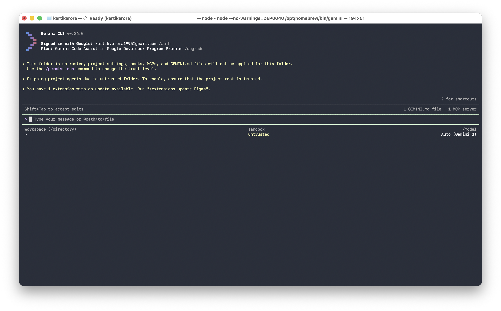
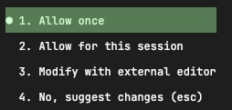
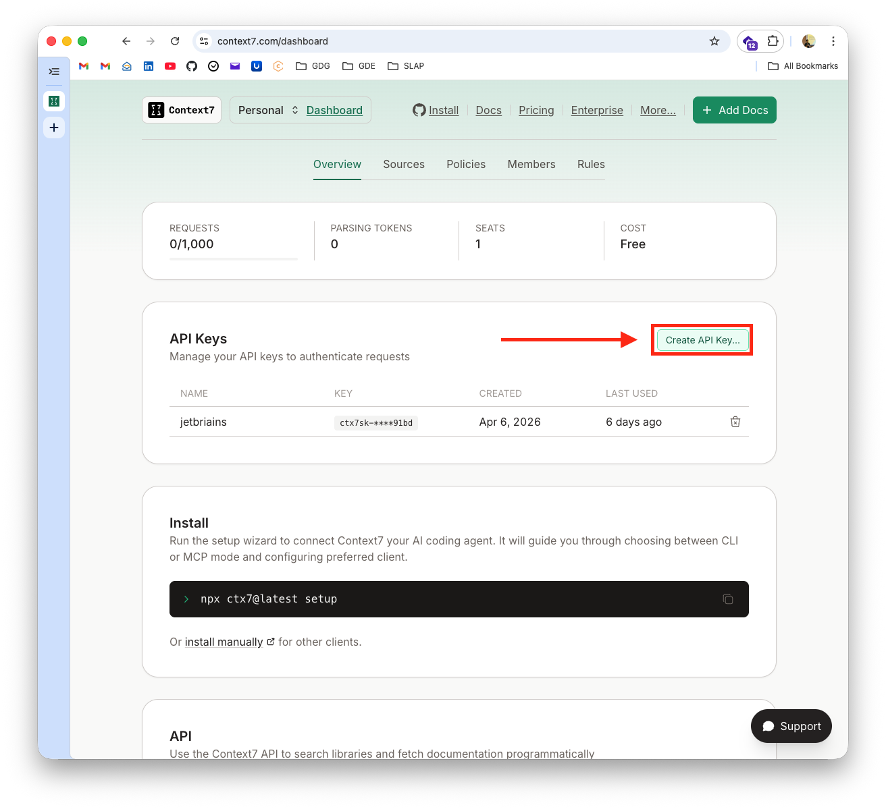

# I Build with AI and so can you! (Android Edition) 🚀

## Welcome!
Duration: 2


Ready to transform how you build Android apps? Today, we're going on an exciting journey into the world of AI-assisted development. You'll learn how to collaborate with AI agents using the **Gemini CLI** by creating clear, structured documents that make them incredibly effective. Think of it as learning to speak the language of your new AI partner!

By the end of this adventure, you'll have a fully functional Android app and a toolkit of AI prompting skills that you can use on any project. Ready to dive in? 🚀

### What You'll Build
- ✨ A rock-solid **Product Requirements Document** (PRD.md)
- 🤖 A personalised **AI Agent configuration** (android-specialist.md)
- 🛠️ A reusable **State Management Skill** (state-management.md)
- 🧪 **Unit Testing Skill** (Bonus)
- 📝 A sleek **Note Taker Android app** with up-to-date documentation via Context7

### Your AI Partner: Gemini CLI
In this workshop, we will use the **Gemini CLI**, a powerful terminal-based agent that can read your codebase, manage project files, and help you architect your app from the ground up.

### What You'll Need
- A personal **@gmail.com** account (see Prerequisites)
- About 45 minutes of focused time
- A basic understanding of Android development (Kotlin & Compose)
- **Android Studio** installed (to run and test your app easily)

---

## Prerequisites
Duration: 5

To ensure a smooth experience during this workshop, please review and complete these prerequisites.

### 1. Use a Personal Account
Please use a personal **@gmail.com** account. Corporate or organization-managed accounts often have administrative restrictions that block these tools. Using a personal account ensures a "zero-hiccup" experience with no credit card or API tokens required.

### 2. Install Gemini CLI

1. **Install the CLI:**
Choose your preferred package manager:
```bash
# macOS/Linux (Homebrew)
brew install gemini-cli
```
```bash
# OR using npm (All Platforms)
npm install -g gemini-cli
```
2. **Authenticate:**
Run the CLI in your terminal and select "**Sign in with Google**":
```bash
gemini
```



### 3. Install Android Studio
Download and install the latest version of **Android Studio** from the official website: [developer.android.com/studio](https://developer.android.com/studio). This will be used to build and run your application.

### 4. Choose Your Objective
During the workshop, the workflow remains the same regardless of what you build:
- **Guided**: Follow this Codelab to build a sample application from scratch.
- **Independent**: Bring a specific idea, a small feature, or a prototype you want to build using these AI tools.

---

## Getting Set Up
Duration: 3

Now that you've installed the Gemini CLI, let's get your project workspace ready!

1. **Create your project space:**
Open your terminal and run:
```bash
mkdir -p my-note-taker/.gemini/{prd,skills,agents}
cd my-note-taker
```

2. **Verify Authentication:**
Run `gemini` in your terminal to ensure you're signed in. If not, follow the prompt to "Sign in with Google."

🌟 **Great job! Your workspace is ready. Let's start building.**

---

## Create your PRD
Duration: 7

Let's start with the most important part: the **Product Requirements Document (PRD)**. This is the heart of your project—it's the source of truth that helps your AI assistant understand exactly what you're dreaming of building!

### The Prompt (Ready to copy-paste!)
Copy this prompt and get ready to see Gemini's magic in action:

```
Act as a Senior Android Architect.

Create a Product Requirements Document (PRD) for a "Note Taker" Android app and save it to `.gemini/prd/PRD.md`.
Please ensure that the markdown file begins with the following frontmatter:
---
name: Note Taker Android App
description: An Android application for taking notes.
version: 0.1.0
---

REQUIREMENTS:
- Kotlin & Jetpack Compose
- MVVM Architecture
- In-memory storage (StateFlow) for simplicity
- Material 3 Expressive Design

Ask me clarifying questions, one at a time.
```

### Steps:

1. **Launch Gemini CLI:**
```bash
gemini
```

2. **Paste the prompt** into the interactive shell.
3. Once generated, the tool will ask for permission to write the file.



✨ **Fantastic! Your PRD is ready. Let's keep the momentum going!**

---

## Configure your AI Agent
Duration: 6

Now, let's give your AI assistant a personality and some clear instructions. This `android-specialist.md` file will define how your AI partner thinks and works, ensuring they always follow your lead and technical standards.

### The Prompt
```
Create an agent configuration for an AI coding assistant and save it to `.gemini/agents/android-specialist.md`.
Please ensure that the markdown file begins with the following frontmatter:
---
name: Android Specialist
description: A senior Android engineer specialising in Kotlin and Compose.
skills: [state-management]
prompt: "You are a Senior Android Engineer specialising in Kotlin and Jetpack Compose..."
version: 0.1.0
---

CONTEXT:
- Kotlin & Jetpack Compose
- MVVM Architecture
- In-memory data management
- Material 3 Expressive Design

STRUCTURE:
1. ROLE: Persona (senior Android engineer, Kotlin/Compose specialist)
2. BEHAVIOR: How to work (read PRD first, use tools, test code)
3. COMMUNICATION: Style (concise, direct, professional)
4. TECHNICAL STANDARDS:
   - Modern Android Development (MAD)
   - Google's ViewModel (Architecture Components)
   - Repository Pattern (using in-memory data)
   - Material 3 Expressive Design
   - Gradle (Kotlin DSL) as the build system
   - Version Catalogs (libs.versions.toml) for dependencies
5. PROHIBITED:
   - No legacy View system (XML layouts)
   - No hardcoded dependency versions (use TOML)
   - No God-objects

Format as markdown with clear sections.
```

### Steps:

1. **Paste the prompt** into the `gemini` shell.
2. Review the generated configuration.
3. Once generated, the tool may ask for permission to write the file if you have not allowed it for the session.

🚀 **Agent configured! You're building a solid foundation.**

---

## Add a State Management Skill
Duration: 7

Skills are like "mini-manuals" that teach your AI exactly how to handle specific tasks. Let's create one for managing data, giving your assistant the expertise it needs to be super reliable!

### The Prompt
```
Create a SKILL document: "State Management with StateFlow" and save it to `.gemini/skills/state-management.md`.
Please ensure that the markdown file begins with the following frontmatter:
---
name: State Management with StateFlow
description: Manage app state safely using Kotlin StateFlow and Compose.
version: 0.1.0
---

STRUCTURE:

## SKILL: State Management

### Purpose
Safe, reactive state management using StateFlow in ViewModels.

### When to Use
- Managing UI state for lists, forms, or navigation.
- Caching data in memory during the app session.

### Mandates (REQUIRED)
1. Use `MutableStateFlow` for internal state and `StateFlow` for exposure.
2. Update state atomically using `.update { ... }`.
3. Use `collectAsStateWithLifecycle()` in Compose.
4. Keep the ViewModel agnostic of the UI.

### Prohibited (FORBIDDEN)
- Never use `MutableState` (Compose State) inside a ViewModel; prefer StateFlow.
- Don't expose `MutableStateFlow` directly to the View.

### Example Implementation
```kotlin
data class NoteUiState(
    val notes: List<Note> = emptyList(),
    val isLoading: Boolean = false
)

class NoteViewModel : ViewModel() {
    private val _uiState = MutableStateFlow(NoteUiState())
    val uiState: StateFlow<NoteUiState> = _uiState.asStateFlow()

    fun addNote(note: Note) {
        _uiState.update { it.copy(notes = it.notes + note) }
    }
}
```

### Steps:

1. **Paste the prompt** into the `gemini` shell.
2. Review the skill documentation.
3. Once generated, the tool will may for permission to write the file.

🎉 **Spot on! You just built a reusable skill. Ready to see it all come together?**

---

## Time to Build!
Duration: 15

Now for the best part! We're going to use all those documents you just created to build your actual app. It's time to see your hard work pay off!

### Generate the code
It's time to let the AI do the heavy lifting while you take the lead as the architect. This is where your vision truly becomes reality!

**Prompt:**
```
Build a note taker app following these documents:

PRD: @.gemini/prd/PRD.md
AGENT: @.gemini/agents/android-specialist.md
SKILL: @.gemini/skills/state-management.md

Create the following components:
1. Note data class
2. ViewModel using the State Management SKILL
3. Compose UI for listing and adding notes

Features:
- Add note
- Delete note
- List notes in a scrollable list
- Material 3 styling

Follow ALL PRD constraints. Use in-memory storage for now.
```

### Steps:

1. **Paste the build prompt** into the `gemini` shell.
2. The agent will read your documents and propose file creations/updates.
3. Review the code and allow the tool to write the files if needed.

### Try it out!

To run your app, we'll use **Android Studio**. It provides a pre-configured environment with everything you need.

1. **Open Android Studio.**
2. **Open your project folder** (`my-note-taker`).
3. **Wait for Gradle to sync** (this might take a minute).
4. **Run the app** on an emulator or a real device by clicking the green "Play" icon.
5. Verify your features:
- ✅ Add notes
- ✅ Delete notes
- ✅ See them appear in the list

📱 **Amazing! You've just built a functional Android app with AI—using the CLI for creation and Android Studio for execution!**

---

## Connect to the World with Context7
Duration: 8

Want to take things to the next level? You can give your AI assistant access to the latest documentation and code examples using Context7. This ensures your partner is always up-to-date and helps you avoid "AI hallucinations" from outdated training data!

**Context7** is an open-source Model Context Protocol (MCP) server developed by Upstash designed to provide AI coding assistants (like Cursor, Claude, and Windsurf) with up-to-date, version-specific documentation.

### Get Your API Key

1. Go to [context7.com/dashboard](https://context7.com/dashboard)
2. **Create an account** (using your GitHub or Google account).
3. Sign in and generate your **Context7 API key**.



### Configure MCP

Choose the method that fits your workflow:

#### Option A: CLI Setup (Easiest)
Install the Context7 CLI to automatically configure your MCP server.

1. **Install the CLI:**

Choose your preferred package manager:
```bash
# Using npm
npm install -g ctx7
```
```
# OR using Homebrew (macOS)
brew install ctx7
```

2. **Run the setup:**
```bash
ctx7 setup
```
Follow the prompts to sign in. The CLI will automatically detect and configure your MCP clients (Gemini CLI, Cursor, etc.).

---

#### Option B: Manual Configuration (No Global Install)
If you prefer not to install it globally, you can manually configure the settings.

1. **Get your API Key:** Follow the "Get Your API Key" steps above.

2. **Open settings file:**
```bash
# Create if doesn't exist
mkdir -p ~/.gemini
touch ~/.gemini/settings.json
```

3. **Edit `~/.gemini/settings.json`:**
```json
{
  "mcpServers": {
    "context7": {
      "httpUrl": "https://mcp.context7.com/mcp",
      "headers": {
        "CONTEXT7_API_KEY": "YOUR_API_KEY",
        "Accept": "application/json, text/event-stream"
      }
    }
  }
}
```

4. **Verify:**
```bash
# inside gemini shell
/mcp list
```

### How to Use Context7 for Android

**Natural prompts:**
```
Use context7 to find the latest documentation for StateFlow and Coroutines.
```
```
What is the newest way to handle navigation in Jetpack Compose? Use context7.
```
```
Check context7 for the correct API usage for the latest Material 3 components.
```

**Why it matters:**
By using Context7, your AI assistant stays informed about the latest tools and libraries, reducing bugs and ensuring you're using modern, secure patterns. 🎉

**Available MCP tools:**
- `resolve-library-id` - Find library identifiers
- `get-library-docs` - Fetch latest documentation

🧠 **Incredible! Your AI assistant now has access to the most current Android documentation in the world.**

---

## Bonus: Add a Unit Testing Skill
Duration: 8

Ready for one last skill? Let's teach your AI how to write tests for your code, ensuring everything is rock-solid and works perfectly every single time.

**Prompt:**
```
Create a SKILL document: "Unit Testing for Android" and save it to `.gemini/skills/unit-testing.md`.
Please ensure that the markdown file begins with the following frontmatter:
---
name: Unit Testing for Android
description: Ensure code reliability using JUnit and Turbine for Flow testing.
version: 0.1.0
---

STRUCTURE:

## SKILL: Unit Testing

### Purpose
Ensure business logic is correct using unit tests.

### When to Use
- Testing ViewModels
- Testing Repositories
- Testing utility functions

### Mandates (REQUIRED)
1. Use JUnit 4/5.
2. **Use Turbine for all Flow/StateFlow testing.**
3. Test both success and error states.
4. Keep tests isolated from Android framework dependencies.

### Example Implementation
```kotlin
class NoteViewModelTest {
    @Test
    fun `when adding a note, uiState emits new state`() = runTest {
        val viewModel = NoteViewModel()
        
        viewModel.uiState.test {
            // Initial state
            assert(awaitItem().notes.isEmpty())
            
            viewModel.addNote(Note(title = "Title", content = "Content"))
            
            // Updated state
            val updatedState = awaitItem()
            assert(updatedState.notes.size == 1)
            assert(updatedState.notes[0].title == "Title")
        }
    }
}
```

### Testing
- **Run tests in Android Studio:** Open the test file and click the double green arrows next to the class name.
- **Or use the CLI:** `./gradlew test` (if you have Java configured).

🧪 **Great work! You've just added a professional layer of testing to your project.**

---

## Congratulations! 🏆
Duration: 2

You did it! 🏆 You've gone from zero to a fully functional, AI-powered Android app using the **Gemini CLI**. More importantly, you've mastered the art of "guiding" AI with structured documentation.

### Look at everything you've achieved:
- ✨ **Structured AI Docs**: You created a PRD, AGENT, and SKILL files for Android.
- 📱 **A Real Android App**: You built a complete note taker using Compose and StateFlow.
- 🧠 **Up-to-date Intelligence**: You gave your AI the latest documentation via Context7.
- 🚀 **New Workflows**: You've learned a faster, more architectural way to build mobile apps using a hybrid CLI-IDE approach.

### Your New Superpowers

**The Old Way:**
- Fighting with Gradle and XML layouts
- Endless searching for "how to handle state" on SO
- Writing repetitive boilerplate manually

**The New Way (The AI Way!):**
- Defining clear, high-level requirements
- Guiding AI with structure and context
- Focusing on architecture and reviewing outcomes
- **Leveraging the best of both worlds: CLI for AI collaboration and IDE for stable execution.**

### Tools You Mastered

- **Gemini CLI**
- **Context7**
- **Android Studio** (for building, running, and testing)

### What's Next?
The sky's the limit! Why not try:
1. Adding persistent storage using Room (the next step!)
2. Building a new skill for WorkManager (syncing notes)
3. Sharing your PRD template with your mobile team
4. Integrating Context7 into your professional Android projects

### Additional Resources

- **Android Developers:** [developer.android.com](https://developer.android.com)
- **Google Skills**: [github.com/google/skills](https://github.com/google/skills)
- **MCP**: [modelcontextprotocol.io](https://modelcontextprotocol.io)
- **Context7:** [github.com/upstash/context7](https://github.com/upstash/context7)
---
