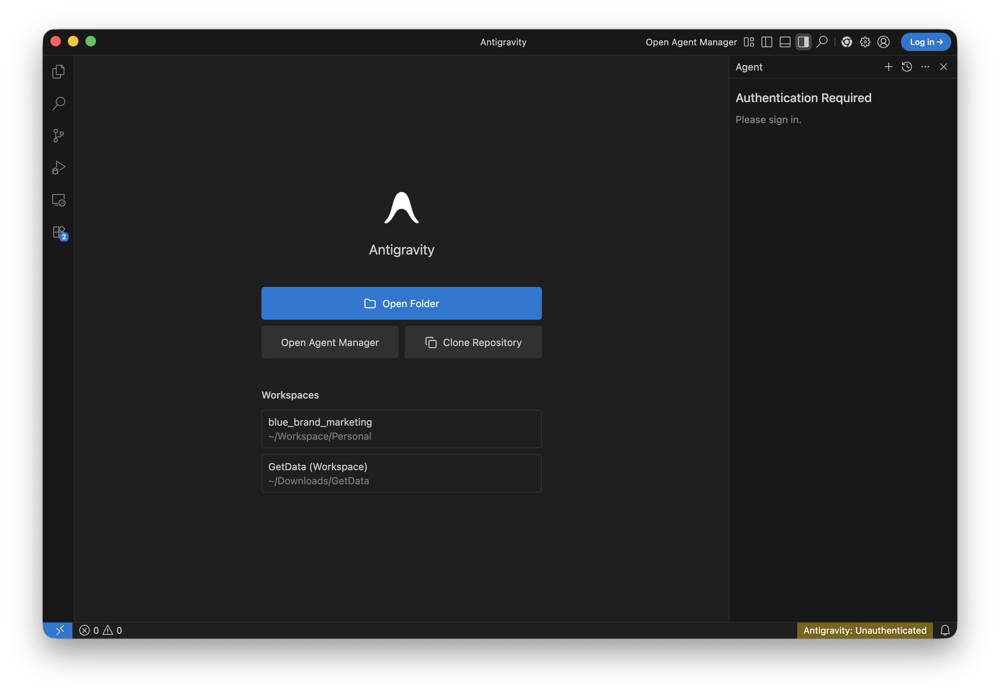

# I Build with AI and so can you! 🚀

## Welcome!
Duration: 2


Ready to transform how you build software? Today, we're going on an exciting journey into the world of AI-assisted development. You'll learn how to collaborate with AI agents by creating clear, structured documents that make them incredibly effective. Think of it as learning to speak the language of your new AI partner!

By the end of this adventure, you'll have a fully functional app and a toolkit of AI prompting skills that you can use on any project. Ready to dive in? 🚀

### What You'll Build
- ✨ A rock-solid **Product Requirements Document** (PRD.md)
- 🤖 A personalised **AI Agent configuration** (frontend-specialist.md)
- 🛠️ A reusable **LocalStorage Skill** (localstorage.md)
- 🧪 **Unit Testing Skill** (Bonus)
- 📝 A sleek **Task Manager web app** with up-to-date documentation via Context7

### Choose Your Favourite Tool
**Pick the one that fits your style:**
- **Antigravity** (A modern, agentic editor built for AI)
- **Gemini CLI** (Perfect if you love the terminal)
- **IntelliJ IDEA + Gemini** (The power of a full-featured IDE)

### What You'll Need
- A personal **@gmail.com** account (see Prerequisites)
- About 45 minutes of focused time
- A basic understanding of web development

---

## Prerequisites
Duration: 5

To ensure a smooth experience during this workshop, please review and complete these prerequisites.

### 1. Use a Personal Account
Please use a personal **@gmail.com** account. Corporate or organization-managed accounts often have administrative restrictions that block these tools. Using a personal account ensures a "zero-hiccup" experience with no credit card or API tokens required.

### 2. Pre-Workshop Tool Installation
To save time during the session, please install **one** of the following tools (your choice) before arriving:

#### Option A: Antigravity (Standalone Editor)
- Download the editor from [antigravity.google](https://antigravity.google).
- Launch the app and **Sign in with Google**.



#### Option B: Gemini CLI (Terminal)
- **Prerequisite**: Node.js 20.0.0+.
- **Installation**:
  - **macOS/Linux**: `brew install gemini-cli` (Homebrew) or `npm install -g @google/gemini-cli`
  - **Windows**: `npm install -g @google/gemini-cli`
- **Authentication**: Run `gemini` in your terminal and select "**Sign in with Google**."


#### Option C: Gemini Code Assist (IDE Plugin)
- Install the extension in **VS Code** or **IntelliJ**.
- Open the extension, click the Gemini icon, and **Sign in with Google**.

### 3. Choose Your Objective
During the workshop, the workflow remains the same regardless of what you build:
- **Guided**: Follow this official Codelab to build a sample application from scratch.
- **Independent**: Bring a specific idea, a small feature, or a prototype you want to build using these AI tools.

---

## Getting Set Up
Duration: 3

Now that you've installed your chosen tool, let's get your project workspace ready!

### Option 1: Antigravity
If you're using the standalone editor.

1. **Launch Antigravity** and ensure you're signed in.
2. **Start a new project:** Name it `my-task-manager`.
3. **Explore:** Antigravity is ready to help you generate files right inside the editor!

### Option 2: Gemini CLI
If you're using the terminal, set up your project structure.

1. **Create your project space:**
```bash
mkdir -p my-task-manager/.gemini/{prd,skills,agents}
cd my-task-manager
```

2. **Verify Authentication:**
Run `gemini` in your terminal to ensure you're signed in. If not, follow the prompt to "Sign in with Google."

### Option 3: IntelliJ + Gemini
If you're using the IDE.

1. **Open IntelliJ IDEA.**
2. **Create your project:** `File` → `New Project` → `my-task-manager`.
3. **Open the Gemini panel:** `View` → `Tool Windows` → `Gemini`.
4. **Sign in** if you haven't already.

🌟 **Great job! Your workspace is ready. Let's start building.**

---

## Create your PRD
Duration: 7

Let's start with the most important part: the **Product Requirements Document (PRD)**. This is the heart of your project—it's the source of truth that helps your AI assistant understand exactly what you're dreaming of building!

### The Prompt (Ready to copy-paste!)
Copy this prompt and get ready to see Gemini's magic in action:

```
Act as a Senior Software Architect.

Create a Product Requirements Document (PRD) for a "Task Manager" web app and save it to `.gemini/prd/PRD.md`.
Please ensure that the markdown file begins with the following frontmatter:
---
name: Task Manager Web App
description: A web application for managing tasks.
version: 0.1.0
---

REQUIREMENTS:
- Single HTML file (no build tools)
- Vanilla JavaScript only (no frameworks)
- LocalStorage for persistence
- Mobile responsive

Ask me clarifying questions, one at a time.
```

### Option 1: Antigravity

1. Use the AI chat panel (Cmd/Ctrl+L or chat icon)
2. Paste the prompt above
3. Antigravity will generate and create the file automatically (it will ask for permission)

### Option 2: Gemini CLI

1. **Launch Gemini CLI:**
```bash
gemini
```

2. **Paste the prompt** (the one above) into the interactive shell.
3. Once generated, the tool will ask for permission to write the file.

### Option 3: IntelliJ

1. Open Gemini panel: `View` → `Tool Windows` → `Gemini`
2. Paste the prompt → Send
3. Gemini will ask to create the file → Click **"Accept"**

✨ **Fantastic! Your PRD is ready. Let's keep the momentum going!**

---

## Configure your AI Agent
Duration: 6

Now, let's give your AI assistant a personality and some clear instructions. This `frontend-specialist.md` file will define how your AI partner thinks and works, ensuring they always follow your lead and technical standards.

### The Prompt (Same for All Tools)
```
Create an agent configuration for an AI coding assistant and save it to `.gemini/agents/frontend-specialist.md`.
Please ensure that the markdown file begins with the following frontmatter:
---
name: Frontend Specialist
description: A senior frontend engineer specialising in vanilla JS.
skills: [localstorage]
prompt: "You are a Senior Frontend Engineer specialising in vanilla JS..."
version: 0.1.0
---

CONTEXT (from PRD):
- Vanilla JavaScript only
- No frameworks/build tools
- LocalStorage for data
- Mobile responsive

STRUCTURE:
1. ROLE: Persona (senior frontend engineer, vanilla JS specialist)
2. BEHAVIOR: How to work (read PRD first, use tools, test code)
3. COMMUNICATION: Style (concise, direct, professional)
4. TECHNICAL STANDARDS:
   - Semantic HTML5
   - CSS custom properties
   - Vanilla JS ES6+
   - Accessibility first
5. PROHIBITED:
   - No React/Vue/frameworks
   - No npm dependencies
   - No inline styles
   - No build tools

Format as markdown with clear sections.
```

### Option 1: Antigravity

1. Use AI chat (Cmd/Ctrl+L)
2. Paste prompt → Antigravity generates and creates the file

### Option 2: Gemini CLI

1. **Launch Gemini CLI:**
```bash
gemini
```

2. **Paste the prompt** into the interactive shell.
3. Once generated, the tool will ask for permission to write the file.

### Option 3: IntelliJ

1. Use Gemini panel
2. Paste prompt → Accept file creation

🚀 **Agent configured! You're building a solid foundation.**

---

## Add a LocalStorage Skill
Duration: 7

Skills are like "mini-manuals" that teach your AI exactly how to handle specific tasks. Let's create one for managing data, giving your assistant the expertise it needs to be super reliable!

### The Prompt (Same for All Tools)
```
Create a SKILL document: "LocalStorage Management" and save it to `.gemini/skills/localstorage.md`.
Please ensure that the markdown file begins with the following frontmatter:
---
name: LocalStorage Management
description: Manage LocalStorage safely with error handling and fallback.
version: 0.1.0
---

STRUCTURE:

## SKILL: LocalStorage Management

### Purpose
Safe, consistent LocalStorage operations with error handling

### When to Use
- Saving user data
- Caching state
- Persisting preferences

### Mandates (REQUIRED)
1. Always use try-catch
2. Validate data before saving
3. Use JSON.stringify/parse for objects
4. Provide fallback for disabled localStorage

### Prohibited (FORBIDDEN)
- Never store passwords/tokens
- Don't save without validation
- Avoid large datasets (>5MB)

### Example Implementation
```javascript
// Save with error handling
function saveTasks(tasks) {
  try {
    if (!Array.isArray(tasks)) throw new Error('Invalid data');
    localStorage.setItem('tasks', JSON.stringify(tasks));
    return true;
  } catch (error) {
    console.error('Save failed:', error);
    return false;
  }
}

// Load with fallback
function loadTasks() {
  try {
    const data = localStorage.getItem('tasks');
    return data ? JSON.parse(data) : [];
  } catch (error) {
    console.error('Load failed:', error);
    return [];
  }
}
```

### Option 1: Antigravity

1. Use AI chat → Paste prompt
2. Antigravity generates and creates the file

### Option 2: Gemini CLI

1. **Launch Gemini CLI:**
```bash
gemini
```

2. **Paste the prompt** into the interactive shell.
3. Once generated, the tool will ask for permission to write the file.

### Option 3: IntelliJ

1. Use Gemini panel → Paste prompt → Accept file creation

🎉 **Spot on! You just built a reusable skill. Ready to see it all come together?**

---

## Time to Build!
Duration: 15

Now for the best part! We're going to use all those documents you just created to build your actual app. It's time to see your hard work pay off!

### Generate the code
It's time to let the AI do the heavy lifting while you take the lead as the architect. This is where your vision truly becomes reality!

**Prompt (Same for All Tools):**
```
Build a task manager following these documents:

PRD: @.gemini/prd/PRD.md
AGENT: @.gemini/agents/frontend-specialist.md
SKILL: @.gemini/skills/localstorage.md

Create a single `index.html` file with:
1. HTML structure (semantic tags)
2. CSS (custom properties, mobile-first)
3. JavaScript (vanilla, using the LocalStorage SKILL)

Features:
- Add task
- Delete task
- Mark complete
- Persist data (using SKILL pattern)

Follow ALL PRD constraints.
No frameworks. No build tools.
```

### Option 1: Antigravity

1. Use AI chat with the build prompt
2. Reference your PRD, AGENT, SKILL files (Antigravity can read project files)
3. Agent generates and creates `index.html`

### Option 2: Gemini CLI

1. **Launch Gemini CLI:**
```bash
gemini
```

2. **Paste the build prompt** into the interactive shell.
3. Once generated, the tool will ask for permission to write the file.

### Option 3: IntelliJ

1. Open Gemini panel
2. Paste prompt with your three documents
3. Accept creation of `index.html`

### Try it out!

You've built it—now let's see it in action:
- ✅ Add tasks
- ✅ Delete tasks
- ✅ Mark complete
- ✅ Refresh page (data persists!)
- ✅ Mobile view

📱 **Amazing! You've just built a functional web app with AI. Take a moment to celebrate!**

---

## Keep it consistent with ADRs
Duration: 8

As your project grows, you'll want to remember *why* you made certain decisions. This is where Architectural Decision Records (ADRs) come in handy—they're like a diary for your project's soul!

### Create Your First ADR

**Prompt for Gemini:**
```
Create ADR-001: "Pure CSS and Vanilla JS Architecture" and save it to `.gemini/adrs/ADR-001.md`.
Please ensure that the markdown file begins with the following frontmatter:
---
name: ADR-001
description: Architectural decision to use pure CSS and Vanilla JS
version: 0.1.0
---

Include:
- Context: Why we chose this (no build tools, simple deployment, educational)
- Decision: We will only use CSS Custom Properties and Vanilla ES6+
- Consequences: No Sass/React, but zero dependencies and faster loading
```

#### Option 1: Antigravity
1. Use AI chat (Cmd/Ctrl+L)
2. Paste prompt → Antigravity generates and creates the file

#### Option 2: Gemini CLI
1. **Launch Gemini CLI:**
```bash
gemini
```
2. **Paste the prompt** to create ADR-001 into the interactive shell.
3. Once generated, the tool will ask for permission to write the file.

#### Option 3: IntelliJ
1. Use Gemini panel to generate and accept file creation

### Update frontend-specialist.md

To make your agent follow these decisions, you must link them in `frontend-specialist.md`.

**Prompt for Gemini:**
```
Update .gemini/agents/frontend-specialist.md to include a new section "Rules from ADRs".
Link ADR-001: "Pure CSS and Vanilla JS Architecture" and explain that all new features must comply with it.
```

#### Option 1: Antigravity
1. Use AI chat (Cmd/Ctrl+L)
2. Paste prompt → Antigravity generates and updates the file

#### Option 2: Gemini CLI
1. **Launch Gemini CLI:**
```bash
gemini
```
2. **Paste the prompt** to update `frontend-specialist.md` into the interactive shell.
3. Once generated, the tool will ask for permission to update the file.

#### Option 3: IntelliJ
1. Use Gemini panel to generate the updated content and accept the changes to `.gemini/agents/frontend-specialist.md`

🔒 **Awesome! Now your AI will always know the "why" behind your code choices.**

---

## Connect to the World with Context7
Duration: 8

Want to take things to the next level? You can give your AI assistant access to the latest documentation and code examples using Context7. This ensures your partner is always up-to-date and helps you avoid "AI hallucinations" from outdated training data!

[Context7](https://github.com/upstash/context7) is an open-source MCP server that provides:
- **Up-to-date Info**: Current API signatures and patterns from source repositories.
- **Reduced Hallucinations**: Accurate documentation to prevent fake or broken code.
- **Version-Specific Docs**: Retrieving the right information for the exact library version you're using.
- **Wide Support**: Thousands of popular libraries and frameworks.

### Get Your API Key

1. Go to [console.upstash.com](https://console.upstash.com)
2. Sign in (free tier available)
3. Generate your **Context7 API key**

### Configure MCP (All Tools)

Context7 works as an MCP server. Here's the configuration:

```json
{
  "mcpServers": {
    "context7": {
      "command": "npx",
      "args": [
        "-y",
        "@upstash/context7-mcp",
        "--api-key",
        "YOUR_CONTEXT7_API_KEY"
      ]
    }
  }
}
```

### Option 1: Gemini CLI

1. **Open settings file:**
```bash
# Create if doesn't exist
mkdir -p ~/.gemini
touch ~/.gemini/settings.json
```

2. **Edit `~/.gemini/settings.json`:**
```json
{
  "mcpServers": {
    "context7": {
      "command": "npx",
      "args": [
        "-y",
        "@upstash/context7-mcp",
        "--api-key",
        "YOUR_CONTEXT7_API_KEY"
      ]
    }
  }
}
```

3. **Verify:**
```bash
gemini
# In the CLI, type: /mcp list
# You should see "context7" listed
```

### Option 2: Antigravity

1. **Open Antigravity**
2. **Go to Agent Side Panel**
3. **Click More (...) → MCP Servers → Manage MCP Servers**
4. **Select "View raw config"** to open `mcp_config.json`
5. **Paste the configuration block** and save

### Option 3: IntelliJ + Gemini Code Assist

1. **Gemini Code Assist uses the same file as CLI:** `~/.gemini/settings.json`
2. **Follow the Gemini CLI instructions above**
3. **In IntelliJ, ensure "Agent Mode" is toggled ON** in Gemini chat pane
4. **Restart IntelliJ** if needed

### How to Use Context7

Context7 provides tools to search library documentation and resolve library identifiers.

**Natural prompts:**
```
Use context7 to find the latest documentation for the Chart.js library.

What is the newest way to implement auth in Next.js? Use context7.

Check context7 for the correct API signature for the current version of Tailwind CSS.
```

**Why it matters:**
By using Context7, your AI assistant stays informed about the latest tools and libraries, reducing bugs and ensuring you're using modern, secure patterns. 🎉

**Available MCP tools:**
- `resolve-library-id` - Find library identifiers
- `get-library-docs` - Fetch latest documentation

🧠 **Incredible! Your AI assistant now has access to the most current documentation in the world.**

---

## Bonus: Add a Unit Testing Skill
Duration: 8

Ready for one last skill? Let's teach your AI how to write tests for your code, ensuring everything is rock-solid and works perfectly every single time.

**Prompt (Same for All Tools):**
```
Create a SKILL document: "Unit Testing with Vanilla JS" and save it to `.gemini/skills/unit-testing.md`.
Please ensure that the markdown file begins with the following frontmatter:
---
name: Unit Testing with Vanilla JS
description: Ensure code reliability without external testing frameworks (using simple assertions).
version: 0.1.0
---

STRUCTURE:

## SKILL: Unit Testing

### Purpose
Ensure code reliability without external testing frameworks (using simple assertions)

### When to Use
- Validating business logic
- Testing utility functions
- Regressions checks

### Mandates (REQUIRED)
1. Use a simple `assert(condition, message)` helper
2. Group tests by function/module
3. Log results to the console (Success/Fail)
4. Test both happy path and edge cases

### Prohibited (FORBIDDEN)
- No external dependencies (Jest, Mocha, etc.)
- No complex mocking unless absolutely necessary
- Don't skip error cases

### Example Implementation
```javascript
function assert(condition, message) {
  if (condition) {
    console.log('✅ PASS: ' + message);
  } else {
    console.error('❌ FAIL: ' + message);
  }
}

// Example test suite
function testLocalStorage() {
  console.group('Testing LocalStorage SKILL');
  
  const testData = { id: 1, task: 'Test' };
  saveTasks([testData]);
  const loaded = loadTasks();
  
  assert(loaded.length === 1, 'Should load one task');
  assert(loaded[0].task === 'Test', 'Task content should match');
  
  console.groupEnd();
}
```

### Testing
- Run tests in the browser console
- Verify all assertions pass
```

Format with complete code examples.
```

### Option 1: Antigravity

1. Use AI chat → Paste prompt
2. Antigravity generates and creates the file

### Option 2: Gemini CLI

1. **Launch Gemini CLI:**
```bash
gemini
```

2. **Paste the prompt** into the interactive shell.
3. Once generated, the tool will ask for permission to write the file.

### Option 3: IntelliJ

1. Use Gemini panel → Paste prompt → Accept file creation

🧪 **Great work! You've just added a professional layer of testing to your project.**

---

## Congratulations! 🏆
Duration: 2

You did it! 🏆 You've gone from zero to a fully functional, AI-powered task manager. More importantly, you've mastered the art of "guiding" AI with structured documentation. That's a massive achievement!

### Look at everything you've achieved:
- ✨ **Structured AI Docs**: You created a PRD, AGENT, and SKILL files.
- 📱 **A Real Web App**: You built a complete task manager from scratch.
- 🧠 **Up-to-date Intelligence**: You gave your AI the latest documentation via Context7.
- 🚀 **New Workflows**: You've learned a faster, more architectural way to build.

### Your New Superpowers

**The Old Way:**
- Spending hours memorising syntax
- Endless searching on Stack Overflow
- Writing repetitive boilerplate manually

**The New Way (The AI Way!):**
- Defining clear, high-level requirements
- Guiding AI with structure and context
- Focusing on architecture and reviewing outcomes

### Tools You Mastered

- **Gemini Code Assist** (IntelliJ)
- **Gemini CLI** (Terminal)
- **Google AI Studio** (Web)
- **Context7** (Up-to-date Docs)

### What's Next?
The sky's the limit! Why not try:
1. Adding categories to your tasks
2. Building a new skill for form validation
3. Sharing your PRD template with a friend
4. Integrating Context7 into your next big project

### Resources

- **Gemini:** [aistudio.google.com](https://aistudio.google.com)
- **Context7:** [github.com/upstash/context7](https://github.com/upstash/context7)
- **IntelliJ:** [jetbrains.com/idea](https://jetbrains.com/idea)

---